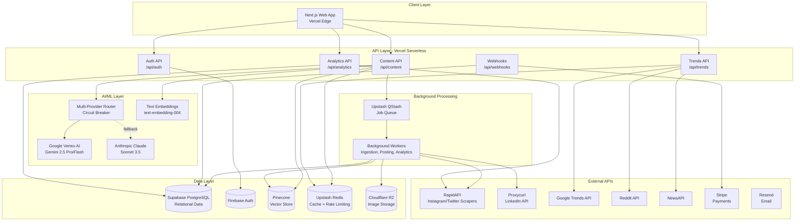
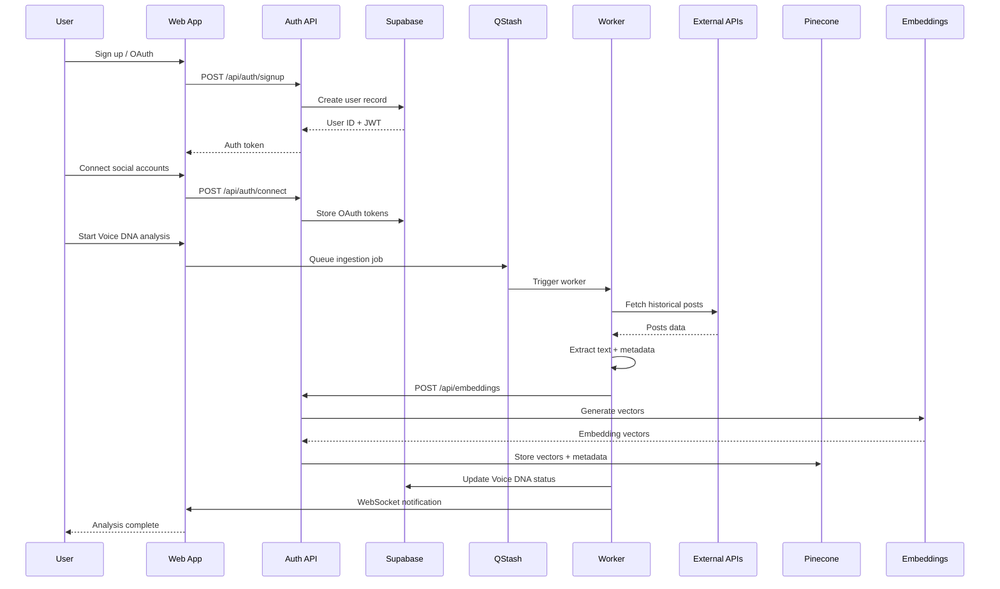
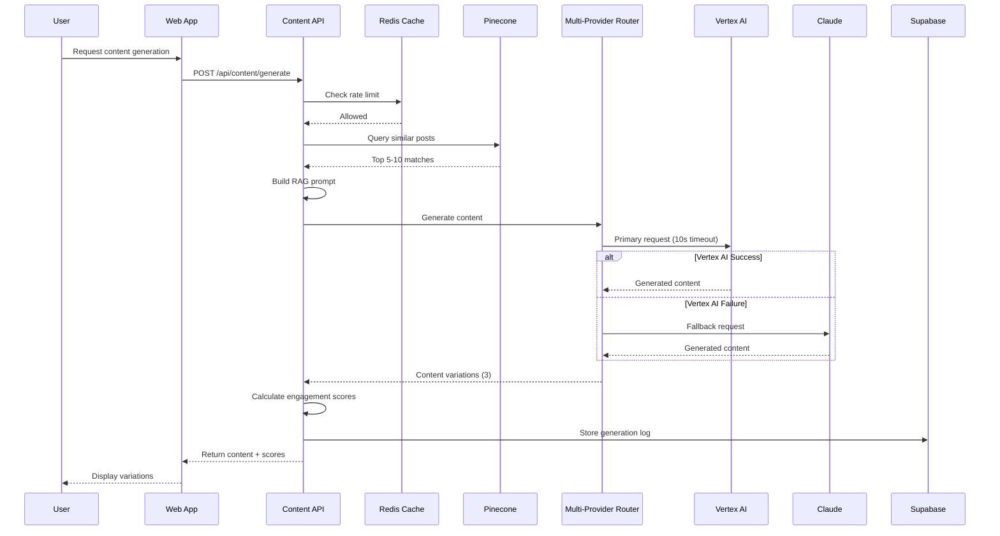
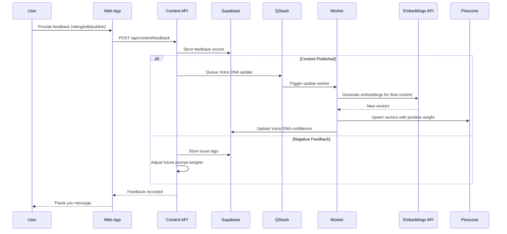

# Design Document: ContextFlow AI

## Overview

ContextFlow AI is a serverless, AI-powered content creation platform built on modern cloud infrastructure. The system architecture follows a microservices pattern using Vercel's serverless functions, with clear separation between frontend (Next.js), backend API layer, AI/ML processing, and data storage layers.

The core innovation lies in the Voice_DNA technology - a multi-stage pipeline that ingests user content, extracts stylistic patterns through embeddings, and uses Retrieval-Augmented Generation (RAG) to produce authentic, personalized content. The system combines this with real-time trend intelligence from multiple sources to create timely, engaging content optimized for each social media platform.

Key architectural decisions:
- **Serverless-first**: Vercel Functions for auto-scaling and zero infrastructure management
- **Multi-AI provider**: Circuit breaker pattern with Vertex AI (primary) and Claude (fallback) for resilience
- **Vector-powered personalization**: Pinecone for semantic search enabling style-matching content generation
- **Edge caching**: Upstash Redis for sub-millisecond response times on frequently accessed data
- **Async processing**: QStash for background jobs (content ingestion, scheduled posting) with retry logic

The system is designed to handle 10,000+ concurrent users while maintaining sub-10-second content generation times and running on free tiers during MVP phase.

## Architecture

### High-Level System Architecture




### Data Flow Diagrams

#### User Onboarding Flow




#### Content Generation Flow




#### Feedback Loop Flow



## Components and Interfaces

### Frontend Components

#### Component Hierarchy

```
App (Next.js 14 App Router)
├── (auth)
│   ├── LoginPage
│   ├── SignupPage
│   └── OnboardingFlow
│       ├── ConnectAccountsStep
│       ├── VoiceDNAAnalysisStep
│       └── PreferencesStep
├── (dashboard)
│   ├── DashboardLayout
│   │   ├── Sidebar
│   │   └── TopNav
│   ├── HomePage
│   │   ├── QuickGenerateCard
│   │   ├── TrendingTopicsWidget
│   │   └── RecentContentList
│   ├── GeneratePage
│   │   ├── PlatformSelector
│   │   ├── TrendSelector
│   │   ├── PromptInput
│   │   ├── ImageUploader
│   │   ├── ContentVariations
│   │   │   └── ContentCard
│   │   │       ├── ContentPreview
│   │   │       ├── EngagementScore
│   │   │       ├── EditButton
│   │   │       └── ScheduleButton
│   │   └── FeedbackPanel
│   ├── CalendarPage
│   │   ├── CalendarView
│   │   ├── ScheduledPostsList
│   │   └── PostStatusBadge
│   ├── AnalyticsPage
│   │   ├── MetricsOverview
│   │   ├── PerformanceCharts
│   │   ├── TopContentTable
│   │   └── InsightsPanel
│   ├── VoiceDNAPage
│   │   ├── StyleSummary
│   │   ├── ConfidenceScore
│   │   ├── TrainingDataList
│   │   └── RefreshButton
│   └── SettingsPage
│       ├── ProfileSettings
│       ├── ConnectedAccounts
│       ├── SubscriptionManagement
│       └── TeamManagement
└── (marketing)
    ├── LandingPage
    ├── PricingPage
    └── DemoPage
```


#### Key Component Interfaces

```typescript
// ContentCard Component
interface ContentCardProps {
  content: GeneratedContent;
  platform: Platform;
  onEdit: (contentId: string, newText: string) => void;
  onSchedule: (contentId: string, scheduledTime: Date) => void;
  onFeedback: (contentId: string, feedback: Feedback) => void;
}

interface GeneratedContent {
  id: string;
  text: string;
  platform: Platform;
  engagementScore: number;
  hashtags: string[];
  suggestedPostTime: Date;
  characterCount: number;
  createdAt: Date;
}

type Platform = 'instagram' | 'linkedin' | 'twitter' | 'threads';

interface Feedback {
  rating: 1 | 2 | 3 | 4 | 5;
  styleMatch: boolean;
  issues?: ('tone' | 'factual' | 'platform' | 'generic')[];
  comment?: string;
}

// PlatformSelector Component
interface PlatformSelectorProps {
  selectedPlatforms: Platform[];
  onChange: (platforms: Platform[]) => void;
  multiSelect: boolean;
}

// TrendSelector Component
interface TrendSelectorProps {
  trends: Trend[];
  selectedTrend?: string;
  onSelect: (trendId: string) => void;
  loading: boolean;
}

interface Trend {
  id: string;
  title: string;
  source: 'google' | 'reddit' | 'news';
  velocity: 'rising' | 'stable' | 'declining';
  relevanceScore: number;
  context: string;
  hashtags: string[];
  updatedAt: Date;
}

// VoiceDNA Component
interface VoiceDNASummaryProps {
  userId: string;
  voiceDNA: VoiceDNA;
  onRefresh: () => void;
}

interface VoiceDNA {
  userId: string;
  confidenceScore: number;
  toneProfile: {
    formal: number;
    casual: number;
    humorous: number;
    professional: number;
  };
  vocabularyPatterns: string[];
  avgSentenceLength: number;
  commonThemes: string[];
  platformStyles: Record<Platform, PlatformStyle>;
  lastUpdated: Date;
  trainingPostCount: number;
}

interface PlatformStyle {
  platform: Platform;
  avgLength: number;
  hashtagUsage: number;
  emojiUsage: number;
  toneAdjustment: string;
}
```


### Backend API Endpoints

#### Authentication Endpoints

```typescript
// POST /api/auth/signup
interface SignupRequest {
  email: string;
  password: string;
  name: string;
}

interface SignupResponse {
  user: User;
  accessToken: string;
  refreshToken: string;
}

// POST /api/auth/login
interface LoginRequest {
  email: string;
  password: string;
}

interface LoginResponse {
  user: User;
  accessToken: string;
  refreshToken: string;
}

// POST /api/auth/oauth
interface OAuthRequest {
  provider: 'google' | 'linkedin';
  code: string;
  redirectUri: string;
}

// POST /api/auth/connect
interface ConnectAccountRequest {
  platform: Platform;
  accessToken: string;
  refreshToken?: string;
}

interface ConnectAccountResponse {
  success: boolean;
  platform: Platform;
  accountInfo: {
    username: string;
    profileUrl: string;
    postCount: number;
  };
}

// POST /api/auth/refresh
interface RefreshTokenRequest {
  refreshToken: string;
}

interface RefreshTokenResponse {
  accessToken: string;
  refreshToken: string;
}
```


#### Content Generation Endpoints

```typescript
// POST /api/content/generate
interface GenerateContentRequest {
  platforms: Platform[];
  prompt?: string;
  trendId?: string;
  imageUrl?: string;
  toneAdjustment?: 'more_formal' | 'more_casual' | 'more_humorous';
  variationCount?: number; // default 3
}

interface GenerateContentResponse {
  variations: GeneratedContent[];
  metadata: {
    generationTime: number;
    provider: 'vertex' | 'claude';
    tokensUsed: number;
  };
}

// POST /api/content/feedback
interface ContentFeedbackRequest {
  contentId: string;
  feedback: Feedback;
  finalText?: string; // if edited
  published: boolean;
}

interface ContentFeedbackResponse {
  success: boolean;
  voiceDNAUpdateQueued: boolean;
}

// POST /api/content/schedule
interface ScheduleContentRequest {
  contentId: string;
  platform: Platform;
  scheduledTime: Date;
  finalText: string;
  imageUrl?: string;
}

interface ScheduleContentResponse {
  success: boolean;
  scheduledPostId: string;
  queuedJobId: string;
}

// GET /api/content/history
interface ContentHistoryQuery {
  page: number;
  limit: number;
  platform?: Platform;
  status?: 'draft' | 'scheduled' | 'published' | 'failed';
}

interface ContentHistoryResponse {
  posts: ScheduledPost[];
  total: number;
  page: number;
  hasMore: boolean;
}

interface ScheduledPost {
  id: string;
  platform: Platform;
  text: string;
  imageUrl?: string;
  scheduledTime: Date;
  publishedTime?: Date;
  status: 'draft' | 'scheduled' | 'published' | 'failed';
  metrics?: PostMetrics;
}

interface PostMetrics {
  likes: number;
  comments: number;
  shares: number;
  impressions: number;
  engagementRate: number;
  lastFetched: Date;
}
```


#### Trends Endpoints

```typescript
// GET /api/trends
interface TrendsQuery {
  categories?: string[];
  sources?: ('google' | 'reddit' | 'news')[];
  limit?: number;
}

interface TrendsResponse {
  trends: Trend[];
  cachedAt: Date;
  nextUpdate: Date;
}

// GET /api/trends/:trendId
interface TrendDetailResponse {
  trend: Trend;
  relatedHashtags: string[];
  keyPoints: string[];
  suggestedAngles: string[];
}

// Voice DNA Endpoints

// GET /api/voice-dna
interface VoiceDNAResponse {
  voiceDNA: VoiceDNA;
  status: 'analyzing' | 'ready' | 'needs_more_data';
  progress?: number; // 0-100 if analyzing
}

// POST /api/voice-dna/refresh
interface RefreshVoiceDNARequest {
  platforms?: Platform[];
}

interface RefreshVoiceDNAResponse {
  success: boolean;
  jobId: string;
  estimatedTime: number; // seconds
}

// POST /api/voice-dna/upload
interface UploadContentRequest {
  platform: Platform;
  posts: {
    text: string;
    timestamp: Date;
    metrics?: {
      likes: number;
      comments: number;
      shares: number;
    };
  }[];
}

interface UploadContentResponse {
  success: boolean;
  postsProcessed: number;
  voiceDNAUpdateQueued: boolean;
}
```


#### Analytics Endpoints

```typescript
// GET /api/analytics/overview
interface AnalyticsOverviewQuery {
  startDate: Date;
  endDate: Date;
  platforms?: Platform[];
}

interface AnalyticsOverviewResponse {
  totalPosts: number;
  avgEngagementRate: number;
  topPerformingPlatform: Platform;
  voiceDNAConfidence: number;
  metrics: {
    platform: Platform;
    posts: number;
    avgEngagement: number;
    totalReach: number;
  }[];
}

// GET /api/analytics/top-content
interface TopContentQuery {
  limit: number;
  metric: 'engagement' | 'likes' | 'comments' | 'shares';
  platforms?: Platform[];
}

interface TopContentResponse {
  posts: (ScheduledPost & { rank: number })[];
}

// GET /api/analytics/insights
interface InsightsResponse {
  bestPostingTimes: Record<Platform, { hour: number; day: string }[]>;
  topHashtags: { tag: string; avgEngagement: number; uses: number }[];
  trendCorrelation: {
    trendId: string;
    trendTitle: string;
    postsUsing: number;
    avgEngagement: number;
  }[];
  contentLengthOptimal: Record<Platform, { min: number; max: number }>;
}

// Image Upload Endpoints

// POST /api/images/upload
interface ImageUploadRequest {
  file: File; // multipart/form-data
}

interface ImageUploadResponse {
  imageUrl: string;
  cdnUrl: string;
  analysis: {
    objects: string[];
    scene: string;
    text?: string;
    mood: string;
    colors: string[];
  };
}

// POST /api/images/analyze
interface ImageAnalyzeRequest {
  imageUrl: string;
}

interface ImageAnalyzeResponse {
  analysis: {
    objects: string[];
    scene: string;
    text?: string;
    mood: string;
    colors: string[];
  };
  suggestedCaptions: string[];
  suggestedHashtags: string[];
}
```


#### Subscription Endpoints

```typescript
// POST /api/subscription/checkout
interface CheckoutRequest {
  tier: 'pro' | 'team';
  billingPeriod: 'monthly' | 'annual';
}

interface CheckoutResponse {
  checkoutUrl: string;
  sessionId: string;
}

// POST /api/subscription/portal
interface PortalResponse {
  portalUrl: string;
}

// GET /api/subscription/status
interface SubscriptionStatusResponse {
  tier: 'free' | 'pro' | 'team';
  status: 'active' | 'canceled' | 'past_due';
  currentPeriodEnd: Date;
  usage: {
    generationsUsed: number;
    generationsLimit: number;
    resetDate: Date;
  };
}

// Webhook Endpoints

// POST /api/webhooks/stripe
interface StripeWebhookPayload {
  type: string;
  data: {
    object: any;
  };
}

// POST /api/webhooks/qstash
interface QStashWebhookPayload {
  jobId: string;
  jobType: 'content_ingestion' | 'voice_dna_update' | 'scheduled_post' | 'metrics_fetch';
  payload: any;
}
```

## Data Models

### Supabase Database Schema

```sql
-- Users table (extends Supabase auth.users)
CREATE TABLE public.profiles (
  id UUID PRIMARY KEY REFERENCES auth.users(id) ON DELETE CASCADE,
  email TEXT NOT NULL,
  name TEXT NOT NULL,
  avatar_url TEXT,
  onboarding_completed BOOLEAN DEFAULT FALSE,
  voice_dna_status TEXT DEFAULT 'pending' CHECK (voice_dna_status IN ('pending', 'analyzing', 'ready', 'needs_more_data')),
  voice_dna_confidence NUMERIC(5,2) DEFAULT 0,
  voice_dna_last_updated TIMESTAMPTZ,
  subscription_tier TEXT DEFAULT 'free' CHECK (subscription_tier IN ('free', 'pro', 'team')),
  subscription_status TEXT DEFAULT 'active' CHECK (subscription_status IN ('active', 'canceled', 'past_due')),
  stripe_customer_id TEXT UNIQUE,
  created_at TIMESTAMPTZ DEFAULT NOW(),
  updated_at TIMESTAMPTZ DEFAULT NOW()
);

-- RLS Policies
ALTER TABLE public.profiles ENABLE ROW LEVEL SECURITY;
CREATE POLICY "Users can view own profile" ON public.profiles FOR SELECT USING (auth.uid() = id);
CREATE POLICY "Users can update own profile" ON public.profiles FOR UPDATE USING (auth.uid() = id);

-- Indexes
CREATE INDEX idx_profiles_email ON public.profiles(email);
CREATE INDEX idx_profiles_stripe_customer ON public.profiles(stripe_customer_id);
```


```sql
-- Connected accounts
CREATE TABLE public.connected_accounts (
  id UUID PRIMARY KEY DEFAULT gen_random_uuid(),
  user_id UUID NOT NULL REFERENCES public.profiles(id) ON DELETE CASCADE,
  platform TEXT NOT NULL CHECK (platform IN ('instagram', 'linkedin', 'twitter', 'threads')),
  account_username TEXT NOT NULL,
  account_url TEXT,
  access_token TEXT NOT NULL, -- encrypted
  refresh_token TEXT, -- encrypted
  token_expires_at TIMESTAMPTZ,
  post_count INTEGER DEFAULT 0,
  last_sync_at TIMESTAMPTZ,
  created_at TIMESTAMPTZ DEFAULT NOW(),
  updated_at TIMESTAMPTZ DEFAULT NOW(),
  UNIQUE(user_id, platform)
);

ALTER TABLE public.connected_accounts ENABLE ROW LEVEL SECURITY;
CREATE POLICY "Users can manage own accounts" ON public.connected_accounts FOR ALL USING (auth.uid() = user_id);

CREATE INDEX idx_connected_accounts_user ON public.connected_accounts(user_id);
CREATE INDEX idx_connected_accounts_platform ON public.connected_accounts(platform);

-- Historical posts (for Voice DNA training)
CREATE TABLE public.historical_posts (
  id UUID PRIMARY KEY DEFAULT gen_random_uuid(),
  user_id UUID NOT NULL REFERENCES public.profiles(id) ON DELETE CASCADE,
  platform TEXT NOT NULL CHECK (platform IN ('instagram', 'linkedin', 'twitter', 'threads')),
  external_id TEXT, -- platform's post ID
  text_content TEXT NOT NULL,
  image_url TEXT,
  posted_at TIMESTAMPTZ NOT NULL,
  likes INTEGER DEFAULT 0,
  comments INTEGER DEFAULT 0,
  shares INTEGER DEFAULT 0,
  impressions INTEGER DEFAULT 0,
  engagement_rate NUMERIC(5,2),
  hashtags TEXT[],
  pinecone_id TEXT UNIQUE, -- reference to vector in Pinecone
  created_at TIMESTAMPTZ DEFAULT NOW(),
  UNIQUE(user_id, platform, external_id)
);

ALTER TABLE public.historical_posts ENABLE ROW LEVEL SECURITY;
CREATE POLICY "Users can view own posts" ON public.historical_posts FOR SELECT USING (auth.uid() = user_id);

CREATE INDEX idx_historical_posts_user ON public.historical_posts(user_id);
CREATE INDEX idx_historical_posts_platform ON public.historical_posts(platform);
CREATE INDEX idx_historical_posts_posted_at ON public.historical_posts(posted_at DESC);
CREATE INDEX idx_historical_posts_pinecone ON public.historical_posts(pinecone_id);
```


```sql
-- Generated content
CREATE TABLE public.generated_content (
  id UUID PRIMARY KEY DEFAULT gen_random_uuid(),
  user_id UUID NOT NULL REFERENCES public.profiles(id) ON DELETE CASCADE,
  platform TEXT NOT NULL CHECK (platform IN ('instagram', 'linkedin', 'twitter', 'threads')),
  prompt TEXT,
  trend_id UUID REFERENCES public.trends(id),
  image_url TEXT,
  generated_text TEXT NOT NULL,
  final_text TEXT, -- after user edits
  engagement_score NUMERIC(5,2),
  hashtags TEXT[],
  suggested_post_time TIMESTAMPTZ,
  ai_provider TEXT CHECK (ai_provider IN ('vertex', 'claude')),
  tokens_used INTEGER,
  generation_time_ms INTEGER,
  user_rating INTEGER CHECK (user_rating BETWEEN 1 AND 5),
  style_match BOOLEAN,
  feedback_issues TEXT[],
  feedback_comment TEXT,
  published BOOLEAN DEFAULT FALSE,
  created_at TIMESTAMPTZ DEFAULT NOW(),
  updated_at TIMESTAMPTZ DEFAULT NOW()
);

ALTER TABLE public.generated_content ENABLE ROW LEVEL SECURITY;
CREATE POLICY "Users can manage own content" ON public.generated_content FOR ALL USING (auth.uid() = user_id);

CREATE INDEX idx_generated_content_user ON public.generated_content(user_id);
CREATE INDEX idx_generated_content_platform ON public.generated_content(platform);
CREATE INDEX idx_generated_content_created ON public.generated_content(created_at DESC);
CREATE INDEX idx_generated_content_published ON public.generated_content(published);

-- Scheduled posts
CREATE TABLE public.scheduled_posts (
  id UUID PRIMARY KEY DEFAULT gen_random_uuid(),
  user_id UUID NOT NULL REFERENCES public.profiles(id) ON DELETE CASCADE,
  content_id UUID REFERENCES public.generated_content(id) ON DELETE SET NULL,
  platform TEXT NOT NULL CHECK (platform IN ('instagram', 'linkedin', 'twitter', 'threads')),
  text_content TEXT NOT NULL,
  image_url TEXT,
  scheduled_time TIMESTAMPTZ NOT NULL,
  published_time TIMESTAMPTZ,
  status TEXT DEFAULT 'scheduled' CHECK (status IN ('draft', 'scheduled', 'published', 'failed')),
  external_post_id TEXT, -- platform's post ID after publishing
  error_message TEXT,
  retry_count INTEGER DEFAULT 0,
  qstash_job_id TEXT,
  likes INTEGER DEFAULT 0,
  comments INTEGER DEFAULT 0,
  shares INTEGER DEFAULT 0,
  impressions INTEGER DEFAULT 0,
  engagement_rate NUMERIC(5,2),
  metrics_last_fetched TIMESTAMPTZ,
  created_at TIMESTAMPTZ DEFAULT NOW(),
  updated_at TIMESTAMPTZ DEFAULT NOW()
);

ALTER TABLE public.scheduled_posts ENABLE ROW LEVEL SECURITY;
CREATE POLICY "Users can manage own scheduled posts" ON public.scheduled_posts FOR ALL USING (auth.uid() = user_id);

CREATE INDEX idx_scheduled_posts_user ON public.scheduled_posts(user_id);
CREATE INDEX idx_scheduled_posts_status ON public.scheduled_posts(status);
CREATE INDEX idx_scheduled_posts_scheduled_time ON public.scheduled_posts(scheduled_time);
CREATE INDEX idx_scheduled_posts_platform ON public.scheduled_posts(platform);
```


```sql
-- Trends
CREATE TABLE public.trends (
  id UUID PRIMARY KEY DEFAULT gen_random_uuid(),
  title TEXT NOT NULL,
  source TEXT NOT NULL CHECK (source IN ('google', 'reddit', 'news')),
  source_url TEXT,
  velocity TEXT CHECK (velocity IN ('rising', 'stable', 'declining')),
  context TEXT,
  key_points TEXT[],
  hashtags TEXT[],
  categories TEXT[],
  fetched_at TIMESTAMPTZ NOT NULL,
  expires_at TIMESTAMPTZ NOT NULL,
  created_at TIMESTAMPTZ DEFAULT NOW()
);

CREATE INDEX idx_trends_source ON public.trends(source);
CREATE INDEX idx_trends_expires ON public.trends(expires_at);
CREATE INDEX idx_trends_categories ON public.trends USING GIN(categories);

-- Voice DNA metadata
CREATE TABLE public.voice_dna_metadata (
  user_id UUID PRIMARY KEY REFERENCES public.profiles(id) ON DELETE CASCADE,
  tone_formal NUMERIC(5,2) DEFAULT 0,
  tone_casual NUMERIC(5,2) DEFAULT 0,
  tone_humorous NUMERIC(5,2) DEFAULT 0,
  tone_professional NUMERIC(5,2) DEFAULT 0,
  avg_sentence_length NUMERIC(6,2),
  vocabulary_patterns JSONB,
  common_themes TEXT[],
  platform_styles JSONB, -- { platform: { avgLength, hashtagUsage, emojiUsage, toneAdjustment } }
  training_post_count INTEGER DEFAULT 0,
  last_updated TIMESTAMPTZ DEFAULT NOW()
);

ALTER TABLE public.voice_dna_metadata ENABLE ROW LEVEL SECURITY;
CREATE POLICY "Users can view own voice DNA" ON public.voice_dna_metadata FOR SELECT USING (auth.uid() = user_id);

-- Usage tracking
CREATE TABLE public.usage_tracking (
  id UUID PRIMARY KEY DEFAULT gen_random_uuid(),
  user_id UUID NOT NULL REFERENCES public.profiles(id) ON DELETE CASCADE,
  action_type TEXT NOT NULL CHECK (action_type IN ('generation', 'api_call', 'image_upload')),
  resource_type TEXT, -- 'vertex', 'claude', 'embeddings', etc.
  cost_cents INTEGER DEFAULT 0,
  metadata JSONB,
  created_at TIMESTAMPTZ DEFAULT NOW()
);

CREATE INDEX idx_usage_tracking_user ON public.usage_tracking(user_id);
CREATE INDEX idx_usage_tracking_created ON public.usage_tracking(created_at DESC);
CREATE INDEX idx_usage_tracking_action ON public.usage_tracking(action_type);

-- Team workspaces
CREATE TABLE public.workspaces (
  id UUID PRIMARY KEY DEFAULT gen_random_uuid(),
  name TEXT NOT NULL,
  owner_id UUID NOT NULL REFERENCES public.profiles(id) ON DELETE CASCADE,
  created_at TIMESTAMPTZ DEFAULT NOW(),
  updated_at TIMESTAMPTZ DEFAULT NOW()
);

ALTER TABLE public.workspaces ENABLE ROW LEVEL SECURITY;
CREATE POLICY "Workspace members can view" ON public.workspaces FOR SELECT 
  USING (
    owner_id = auth.uid() OR 
    EXISTS (SELECT 1 FROM public.workspace_members WHERE workspace_id = id AND user_id = auth.uid())
  );

CREATE INDEX idx_workspaces_owner ON public.workspaces(owner_id);
```


```sql
-- Workspace members
CREATE TABLE public.workspace_members (
  id UUID PRIMARY KEY DEFAULT gen_random_uuid(),
  workspace_id UUID NOT NULL REFERENCES public.workspaces(id) ON DELETE CASCADE,
  user_id UUID NOT NULL REFERENCES public.profiles(id) ON DELETE CASCADE,
  role TEXT NOT NULL CHECK (role IN ('owner', 'editor', 'viewer')),
  invited_by UUID REFERENCES public.profiles(id),
  invited_at TIMESTAMPTZ DEFAULT NOW(),
  joined_at TIMESTAMPTZ,
  UNIQUE(workspace_id, user_id)
);

ALTER TABLE public.workspace_members ENABLE ROW LEVEL SECURITY;
CREATE POLICY "Workspace members can view members" ON public.workspace_members FOR SELECT 
  USING (
    EXISTS (
      SELECT 1 FROM public.workspaces w 
      WHERE w.id = workspace_id AND (w.owner_id = auth.uid() OR user_id = auth.uid())
    )
  );

CREATE INDEX idx_workspace_members_workspace ON public.workspace_members(workspace_id);
CREATE INDEX idx_workspace_members_user ON public.workspace_members(user_id);

-- Audit log
CREATE TABLE public.audit_log (
  id UUID PRIMARY KEY DEFAULT gen_random_uuid(),
  workspace_id UUID REFERENCES public.workspaces(id) ON DELETE CASCADE,
  user_id UUID NOT NULL REFERENCES public.profiles(id) ON DELETE CASCADE,
  action TEXT NOT NULL,
  resource_type TEXT NOT NULL,
  resource_id UUID,
  metadata JSONB,
  created_at TIMESTAMPTZ DEFAULT NOW()
);

CREATE INDEX idx_audit_log_workspace ON public.audit_log(workspace_id);
CREATE INDEX idx_audit_log_user ON public.audit_log(user_id);
CREATE INDEX idx_audit_log_created ON public.audit_log(created_at DESC);
```

### Pinecone Vector Store Configuration

```typescript
// Pinecone Index Configuration
const pineconeConfig = {
  indexName: 'contextflow-content',
  dimension: 768, // text-embedding-004 dimension
  metric: 'cosine',
  pods: 1,
  replicas: 1,
  podType: 'p1.x1', // starter pod
};

// Namespace structure
const namespaces = {
  historicalPosts: (userId: string) => `user_${userId}_posts`,
  voiceDNA: (userId: string) => `user_${userId}_voice`,
  trends: 'global_trends',
};

// Metadata schema for historical posts
interface PineconePostMetadata {
  userId: string;
  platform: 'instagram' | 'linkedin' | 'twitter' | 'threads';
  postId: string; // Supabase historical_posts.id
  postedAt: number; // Unix timestamp
  engagementRate: number;
  hashtags: string[];
  textLength: number;
  hasImage: boolean;
  tone: 'formal' | 'casual' | 'humorous' | 'professional';
}

// Query filters
interface PineconeQueryFilters {
  userId: string;
  platform?: string;
  minEngagement?: number;
  dateRange?: {
    start: number;
    end: number;
  };
}
```


// Upsert operation
interface PineconeUpsertRequest {
  vectors: {
    id: string; // historical_posts.pinecone_id
    values: number[]; // embedding vector
    metadata: PineconePostMetadata;
  }[];
  namespace: string;
}

// Query operation
interface PineconeQueryRequest {
  vector: number[]; // query embedding
  topK: number; // default 10
  namespace: string;
  filter?: PineconeQueryFilters;
  includeMetadata: boolean;
}

interface PineconeQueryResponse {
  matches: {
    id: string;
    score: number; // cosine similarity
    metadata: PineconePostMetadata;
  }[];
}
```

### Redis Cache Strategy

```typescript
// Cache key patterns
const cacheKeys = {
  trends: (source: string) => `trends:${source}:latest`,
  voiceDNA: (userId: string) => `voice_dna:${userId}`,
  userProfile: (userId: string) => `profile:${userId}`,
  rateLimit: (userId: string, action: string) => `ratelimit:${userId}:${action}`,
  generationCount: (userId: string, period: string) => `usage:${userId}:${period}`,
};

// TTL configuration
const cacheTTL = {
  trends: 3600, // 1 hour
  voiceDNA: 1800, // 30 minutes
  userProfile: 600, // 10 minutes
  rateLimit: 60, // 1 minute
  generationCount: 86400, // 24 hours
};

// Rate limiting configuration
interface RateLimitConfig {
  free: {
    generations: { limit: 10; window: 86400 }; // 10 per day
    apiCalls: { limit: 100; window: 3600 }; // 100 per hour
  };
  pro: {
    generations: { limit: 100; window: 86400 }; // 100 per day
    apiCalls: { limit: 1000; window: 3600 }; // 1000 per hour
  };
  team: {
    generations: { limit: 500; window: 86400 }; // 500 per day
    apiCalls: { limit: 5000; window: 3600 }; // 5000 per hour
  };
}
```


## AI/ML Integration

### Multi-Provider Router with Circuit Breaker

```typescript
// Circuit breaker states
type CircuitState = 'closed' | 'open' | 'half-open';

interface CircuitBreakerConfig {
  failureThreshold: number; // 5 failures
  successThreshold: number; // 2 successes to close
  timeout: number; // 60000ms (1 minute)
  resetTimeout: number; // 300000ms (5 minutes)
}

class AIProviderRouter {
  private vertexCircuit: CircuitBreaker;
  private claudeCircuit: CircuitBreaker;
  
  async generate(prompt: string, options: GenerationOptions): Promise<string> {
    // Try Vertex AI first
    if (this.vertexCircuit.state !== 'open') {
      try {
        const result = await this.callVertex(prompt, options);
        this.vertexCircuit.recordSuccess();
        return result;
      } catch (error) {
        this.vertexCircuit.recordFailure();
        console.error('Vertex AI failed:', error);
      }
    }
    
    // Fallback to Claude
    if (this.claudeCircuit.state !== 'open') {
      try {
        const result = await this.callClaude(prompt, options);
        this.claudeCircuit.recordSuccess();
        return result;
      } catch (error) {
        this.claudeCircuit.recordFailure();
        throw new Error('All AI providers failed');
      }
    }
    
    throw new Error('All AI providers unavailable');
  }
  
  private async callVertex(prompt: string, options: GenerationOptions): Promise<string> {
    const model = options.fast ? 'gemini-2.5-flash' : 'gemini-2.5-pro';
    // Implementation with 10s timeout
  }
  
  private async callClaude(prompt: string, options: GenerationOptions): Promise<string> {
    const model = 'claude-3-5-sonnet-20241022';
    // Implementation with 10s timeout
  }
}

interface GenerationOptions {
  temperature: number;
  maxTokens: number;
  fast: boolean; // use Flash vs Pro
  timeout: number; // milliseconds
}
```


### Voice DNA Analysis Pipeline

```typescript
// Step 1: Content Ingestion
async function ingestUserContent(userId: string, platform: Platform): Promise<void> {
  // Fetch posts from external API
  const posts = await fetchPlatformPosts(userId, platform);
  
  // Store in Supabase
  const insertedPosts = await supabase
    .from('historical_posts')
    .upsert(posts.map(p => ({
      user_id: userId,
      platform,
      external_id: p.id,
      text_content: p.text,
      posted_at: p.timestamp,
      likes: p.likes,
      comments: p.comments,
      shares: p.shares,
      hashtags: extractHashtags(p.text),
    })));
  
  // Generate embeddings
  for (const post of insertedPosts) {
    const embedding = await generateEmbedding(post.text_content);
    const pineconeId = `${userId}_${platform}_${post.id}`;
    
    // Store in Pinecone
    await pinecone.upsert({
      vectors: [{
        id: pineconeId,
        values: embedding,
        metadata: {
          userId,
          platform,
          postId: post.id,
          postedAt: new Date(post.posted_at).getTime(),
          engagementRate: calculateEngagementRate(post),
          hashtags: post.hashtags,
          textLength: post.text_content.length,
          hasImage: !!post.image_url,
          tone: await analyzeTone(post.text_content),
        },
      }],
      namespace: `user_${userId}_posts`,
    });
    
    // Update Supabase with Pinecone ID
    await supabase
      .from('historical_posts')
      .update({ pinecone_id: pineconeId })
      .eq('id', post.id);
  }
}

// Step 2: Voice DNA Extraction
async function extractVoiceDNA(userId: string): Promise<VoiceDNA> {
  // Fetch all user posts
  const { data: posts } = await supabase
    .from('historical_posts')
    .select('*')
    .eq('user_id', userId);
  
  if (posts.length < 5) {
    throw new Error('Insufficient data for Voice DNA analysis');
  }
  
  // Analyze tone distribution
  const toneAnalysis = await analyzeOverallTone(posts.map(p => p.text_content));
  
  // Extract vocabulary patterns
  const vocabularyPatterns = extractVocabularyPatterns(posts);
  
  // Calculate sentence length
  const avgSentenceLength = calculateAvgSentenceLength(posts);
  
  // Extract common themes
  const commonThemes = await extractThemes(posts.map(p => p.text_content));
  
  // Platform-specific styles
  const platformStyles = await analyzePlatformStyles(posts);
  
  // Calculate confidence score
  const confidenceScore = calculateConfidenceScore(posts.length, toneAnalysis);
  
  // Store in database
  await supabase
    .from('voice_dna_metadata')
    .upsert({
      user_id: userId,
      tone_formal: toneAnalysis.formal,
      tone_casual: toneAnalysis.casual,
      tone_humorous: toneAnalysis.humorous,
      tone_professional: toneAnalysis.professional,
      avg_sentence_length: avgSentenceLength,
      vocabulary_patterns: vocabularyPatterns,
      common_themes: commonThemes,
      platform_styles: platformStyles,
      training_post_count: posts.length,
      last_updated: new Date(),
    });
  
  // Update profile
  await supabase
    .from('profiles')
    .update({
      voice_dna_status: 'ready',
      voice_dna_confidence: confidenceScore,
      voice_dna_last_updated: new Date(),
    })
    .eq('id', userId);
  
  return {
    userId,
    confidenceScore,
    toneProfile: toneAnalysis,
    vocabularyPatterns,
    avgSentenceLength,
    commonThemes,
    platformStyles,
    lastUpdated: new Date(),
    trainingPostCount: posts.length,
  };
}
```


### RAG-Powered Content Generation

```typescript
async function generateContent(request: GenerateContentRequest, userId: string): Promise<GeneratedContent[]> {
  // Step 1: Retrieve similar posts from Pinecone
  const queryEmbedding = await generateEmbedding(request.prompt || 'general content');
  
  const similarPosts = await pinecone.query({
    vector: queryEmbedding,
    topK: 10,
    namespace: `user_${userId}_posts`,
    filter: request.platforms.length === 1 ? { platform: request.platforms[0] } : undefined,
    includeMetadata: true,
  });
  
  // Step 2: Fetch Voice DNA
  const { data: voiceDNA } = await supabase
    .from('voice_dna_metadata')
    .select('*')
    .eq('user_id', userId)
    .single();
  
  // Step 3: Fetch trend context (if trendId provided)
  let trendContext = '';
  if (request.trendId) {
    const { data: trend } = await supabase
      .from('trends')
      .select('*')
      .eq('id', request.trendId)
      .single();
    
    trendContext = `
Trending Topic: ${trend.title}
Context: ${trend.context}
Key Points: ${trend.key_points.join(', ')}
Suggested Hashtags: ${trend.hashtags.join(', ')}
`;
  }
  
  // Step 4: Analyze image (if provided)
  let imageContext = '';
  if (request.imageUrl) {
    const imageAnalysis = await analyzeImage(request.imageUrl);
    imageContext = `
Image Description: ${imageAnalysis.scene}
Objects: ${imageAnalysis.objects.join(', ')}
Mood: ${imageAnalysis.mood}
Colors: ${imageAnalysis.colors.join(', ')}
${imageAnalysis.text ? `Text in Image: ${imageAnalysis.text}` : ''}
`;
  }
  
  // Step 5: Build RAG prompt
  const variations: GeneratedContent[] = [];
  
  for (const platform of request.platforms) {
    const platformStyle = voiceDNA.platform_styles[platform];
    const examplePosts = similarPosts.matches
      .filter(m => m.metadata.platform === platform)
      .slice(0, 3)
      .map(m => m.metadata);
    
    const prompt = buildGenerationPrompt({
      platform,
      userPrompt: request.prompt,
      trendContext,
      imageContext,
      voiceDNA,
      platformStyle,
      examplePosts,
      toneAdjustment: request.toneAdjustment,
    });
    
    // Step 6: Generate content
    const generatedText = await aiRouter.generate(prompt, {
      temperature: 0.7,
      maxTokens: platform === 'twitter' ? 280 : 2000,
      fast: false,
      timeout: 10000,
    });
    
    // Step 7: Calculate engagement score
    const engagementScore = await predictEngagement({
      text: generatedText,
      platform,
      userHistory: similarPosts.matches,
      trendRelevance: !!request.trendId,
    });
    
    // Step 8: Extract hashtags
    const hashtags = extractHashtags(generatedText);
    
    // Step 9: Suggest posting time
    const suggestedPostTime = await suggestOptimalPostTime(userId, platform);
    
    variations.push({
      id: generateId(),
      text: generatedText,
      platform,
      engagementScore,
      hashtags,
      suggestedPostTime,
      characterCount: generatedText.length,
      createdAt: new Date(),
    });
  }
  
  return variations;
}
```


### Prompt Engineering Specifications

#### Voice DNA Analysis Prompt

```typescript
const VOICE_DNA_ANALYSIS_PROMPT = `You are an expert content analyst specializing in writing style analysis.

Analyze the following social media posts and extract the author's unique writing voice characteristics.

Posts:
{{POSTS}}

Provide a detailed analysis in the following JSON format:
{
  "tone_profile": {
    "formal": 0-100,
    "casual": 0-100,
    "humorous": 0-100,
    "professional": 0-100
  },
  "vocabulary_patterns": ["pattern1", "pattern2", ...],
  "common_themes": ["theme1", "theme2", ...],
  "sentence_structure": "description",
  "unique_phrases": ["phrase1", "phrase2", ...],
  "emoji_usage": "none|minimal|moderate|heavy",
  "hashtag_style": "description"
}

Focus on:
1. Tone consistency across posts
2. Recurring vocabulary and phrases
3. Sentence length and complexity
4. Use of punctuation and formatting
5. Emotional expression patterns
6. Topic preferences

Be specific and provide actionable insights.`;

// Usage
const toneAnalysis = await aiRouter.generate(
  VOICE_DNA_ANALYSIS_PROMPT.replace('{{POSTS}}', posts.join('\n\n---\n\n')),
  { temperature: 0.3, maxTokens: 2000, fast: false, timeout: 15000 }
);
```

#### Content Generation Prompt (Platform-Specific)

```typescript
const CONTENT_GENERATION_PROMPTS = {
  instagram: `You are a content creator writing an Instagram post that matches the user's authentic voice.

USER'S VOICE DNA:
- Tone: {{TONE_FORMAL}}% formal, {{TONE_CASUAL}}% casual, {{TONE_HUMOROUS}}% humorous
- Average sentence length: {{AVG_SENTENCE_LENGTH}} words
- Common themes: {{COMMON_THEMES}}
- Vocabulary patterns: {{VOCABULARY_PATTERNS}}

PLATFORM STYLE (Instagram):
- Average post length: {{PLATFORM_AVG_LENGTH}} characters
- Hashtag usage: {{HASHTAG_USAGE}} hashtags per post
- Emoji usage: {{EMOJI_USAGE}}

EXAMPLE POSTS FROM USER:
{{EXAMPLE_POSTS}}

{{TREND_CONTEXT}}

{{IMAGE_CONTEXT}}

USER REQUEST: {{USER_PROMPT}}

Generate an Instagram post that:
1. Sounds EXACTLY like the user's authentic voice
2. Matches their typical sentence structure and vocabulary
3. Incorporates the trend naturally (if provided)
4. Describes or complements the image (if provided)
5. Uses appropriate hashtags ({{HASHTAG_USAGE}} hashtags)
6. Stays within {{PLATFORM_AVG_LENGTH}} ± 50 characters
7. Maintains their typical emoji usage pattern

{{TONE_ADJUSTMENT}}

Output ONLY the post text, no explanations.`,

  linkedin: `You are a professional content creator writing a LinkedIn post that matches the user's authentic voice.

USER'S VOICE DNA:
- Tone: {{TONE_PROFESSIONAL}}% professional, {{TONE_FORMAL}}% formal
- Average sentence length: {{AVG_SENTENCE_LENGTH}} words
- Common themes: {{COMMON_THEMES}}
- Vocabulary patterns: {{VOCABULARY_PATTERNS}}

PLATFORM STYLE (LinkedIn):
- Average post length: {{PLATFORM_AVG_LENGTH}} characters
- Hashtag usage: {{HASHTAG_USAGE}} hashtags per post
- Professional tone required

EXAMPLE POSTS FROM USER:
{{EXAMPLE_POSTS}}

{{TREND_CONTEXT}}

{{IMAGE_CONTEXT}}

USER REQUEST: {{USER_PROMPT}}

Generate a LinkedIn post that:
1. Sounds EXACTLY like the user's professional voice
2. Maintains their typical sentence structure and vocabulary
3. Incorporates the trend with professional context (if provided)
4. References the image professionally (if provided)
5. Uses appropriate professional hashtags ({{HASHTAG_USAGE}} hashtags)
6. Stays within {{PLATFORM_AVG_LENGTH}} ± 100 characters
7. Includes a hook in the first line
8. Uses line breaks for readability

{{TONE_ADJUSTMENT}}

Output ONLY the post text, no explanations.`,

  twitter: `You are a content creator writing a Twitter/X post that matches the user's authentic voice.

USER'S VOICE DNA:
- Tone: {{TONE_CASUAL}}% casual, {{TONE_HUMOROUS}}% humorous
- Average sentence length: {{AVG_SENTENCE_LENGTH}} words
- Common themes: {{COMMON_THEMES}}
- Vocabulary patterns: {{VOCABULARY_PATTERNS}}

PLATFORM STYLE (Twitter):
- Maximum length: 280 characters
- Hashtag usage: {{HASHTAG_USAGE}} hashtags per post
- Emoji usage: {{EMOJI_USAGE}}

EXAMPLE POSTS FROM USER:
{{EXAMPLE_POSTS}}

{{TREND_CONTEXT}}

{{IMAGE_CONTEXT}}

USER REQUEST: {{USER_PROMPT}}

Generate a Twitter post that:
1. Sounds EXACTLY like the user's authentic voice
2. Matches their typical vocabulary and style
3. Incorporates the trend naturally (if provided)
4. References the image (if provided)
5. Uses appropriate hashtags ({{HASHTAG_USAGE}} hashtags)
6. MUST be under 280 characters
7. Is punchy and engaging

{{TONE_ADJUSTMENT}}

Output ONLY the post text, no explanations.`,

  threads: `You are a content creator writing a Threads post that matches the user's authentic voice.

USER'S VOICE DNA:
- Tone: {{TONE_CASUAL}}% casual, {{TONE_HUMOROUS}}% humorous
- Average sentence length: {{AVG_SENTENCE_LENGTH}} words
- Common themes: {{COMMON_THEMES}}
- Vocabulary patterns: {{VOCABULARY_PATTERNS}}

PLATFORM STYLE (Threads):
- Average post length: {{PLATFORM_AVG_LENGTH}} characters
- Hashtag usage: {{HASHTAG_USAGE}} hashtags per post
- Conversational tone

EXAMPLE POSTS FROM USER:
{{EXAMPLE_POSTS}}

{{TREND_CONTEXT}}

{{IMAGE_CONTEXT}}

USER REQUEST: {{USER_PROMPT}}

Generate a Threads post that:
1. Sounds EXACTLY like the user's authentic voice
2. Matches their typical conversational style
3. Incorporates the trend naturally (if provided)
4. References the image (if provided)
5. Uses appropriate hashtags ({{HASHTAG_USAGE}} hashtags)
6. Stays within {{PLATFORM_AVG_LENGTH}} ± 50 characters
7. Feels like a natural conversation

{{TONE_ADJUSTMENT}}

Output ONLY the post text, no explanations.`,
};

// Tone adjustment templates
const TONE_ADJUSTMENTS = {
  more_formal: 'Make the tone slightly more formal and professional than usual.',
  more_casual: 'Make the tone slightly more casual and relaxed than usual.',
  more_humorous: 'Add more humor and wit than usual, while staying authentic.',
};
```


#### Image Analysis Prompt

```typescript
const IMAGE_ANALYSIS_PROMPT = `Analyze this image for social media content creation.

Provide a detailed analysis in JSON format:
{
  "scene": "brief description of the overall scene",
  "objects": ["object1", "object2", ...],
  "text": "any text visible in the image (or null)",
  "mood": "overall mood/emotion of the image",
  "colors": ["dominant color1", "color2", ...],
  "suggested_captions": ["caption1", "caption2", "caption3"],
  "suggested_hashtags": ["#hashtag1", "#hashtag2", ...]
}

Focus on:
1. Main subject and context
2. Emotional tone and atmosphere
3. Any text or branding visible
4. Color palette and visual style
5. Potential caption angles
6. Relevant hashtags for discoverability`;

// Usage with Vertex AI Vision
const imageAnalysis = await vertexAI.generateContent({
  model: 'gemini-2.5-pro-vision',
  contents: [{
    role: 'user',
    parts: [
      { text: IMAGE_ANALYSIS_PROMPT },
      { inlineData: { mimeType: 'image/jpeg', data: imageBase64 } }
    ]
  }],
  generationConfig: { temperature: 0.4, maxOutputTokens: 1000 }
});
```

#### Engagement Prediction Prompt

```typescript
const ENGAGEMENT_PREDICTION_PROMPT = `You are a social media analytics expert. Predict the engagement potential of this post.

PLATFORM: {{PLATFORM}}

POST TEXT:
{{POST_TEXT}}

USER'S HISTORICAL PERFORMANCE:
- Average engagement rate: {{AVG_ENGAGEMENT}}%
- Top performing posts: {{TOP_POSTS}}
- Audience size: {{AUDIENCE_SIZE}}

TREND RELEVANCE: {{TREND_RELEVANCE}}

Analyze and provide a score from 0-100 based on:
1. Content quality and clarity
2. Emotional appeal
3. Trend alignment
4. Optimal length for platform
5. Hashtag effectiveness
6. Call-to-action presence
7. Visual appeal (if image included)
8. Posting time optimization

Provide response in JSON:
{
  "engagement_score": 0-100,
  "reasoning": "brief explanation",
  "strengths": ["strength1", "strength2"],
  "improvements": ["suggestion1", "suggestion2"]
}`;
```


## Background Job Processing

### QStash Job Types

```typescript
// Job type definitions
type JobType = 
  | 'content_ingestion'
  | 'voice_dna_update'
  | 'scheduled_post'
  | 'metrics_fetch'
  | 'trend_refresh';

interface QStashJob {
  jobId: string;
  jobType: JobType;
  payload: any;
  retries: number;
  maxRetries: number;
  scheduledFor?: Date;
}

// Content Ingestion Job
interface ContentIngestionJob {
  jobType: 'content_ingestion';
  payload: {
    userId: string;
    platforms: Platform[];
    fullRefresh: boolean;
  };
}

// Voice DNA Update Job
interface VoiceDNAUpdateJob {
  jobType: 'voice_dna_update';
  payload: {
    userId: string;
    triggeredBy: 'feedback' | 'manual_refresh' | 'new_content';
  };
}

// Scheduled Post Job
interface ScheduledPostJob {
  jobType: 'scheduled_post';
  payload: {
    scheduledPostId: string;
    userId: string;
    platform: Platform;
    content: string;
    imageUrl?: string;
  };
}

// Metrics Fetch Job
interface MetricsFetchJob {
  jobType: 'metrics_fetch';
  payload: {
    userId: string;
    postIds: string[];
    platform: Platform;
  };
}

// Trend Refresh Job
interface TrendRefreshJob {
  jobType: 'trend_refresh';
  payload: {
    sources: ('google' | 'reddit' | 'news')[];
    categories: string[];
  };
}
```

### Job Processing Logic

```typescript
// QStash webhook handler
export async function POST(request: Request) {
  const signature = request.headers.get('upstash-signature');
  
  // Verify signature
  if (!verifyQStashSignature(signature, await request.text())) {
    return new Response('Unauthorized', { status: 401 });
  }
  
  const job: QStashJob = await request.json();
  
  try {
    switch (job.jobType) {
      case 'content_ingestion':
        await processContentIngestion(job.payload);
        break;
      case 'voice_dna_update':
        await processVoiceDNAUpdate(job.payload);
        break;
      case 'scheduled_post':
        await processScheduledPost(job.payload);
        break;
      case 'metrics_fetch':
        await processMetricsFetch(job.payload);
        break;
      case 'trend_refresh':
        await processTrendRefresh(job.payload);
        break;
      default:
        throw new Error(`Unknown job type: ${job.jobType}`);
    }
    
    return new Response('OK', { status: 200 });
  } catch (error) {
    console.error(`Job ${job.jobId} failed:`, error);
    
    // Retry logic
    if (job.retries < job.maxRetries) {
      await qstash.publishJSON({
        url: `${process.env.APP_URL}/api/webhooks/qstash`,
        body: { ...job, retries: job.retries + 1 },
        delay: Math.pow(2, job.retries) * 60, // Exponential backoff
      });
    } else {
      // Mark as failed in database
      await markJobFailed(job.jobId, error.message);
    }
    
    return new Response('Retry scheduled', { status: 500 });
  }
}

// Scheduled post processing
async function processScheduledPost(payload: ScheduledPostJob['payload']) {
  const { scheduledPostId, userId, platform, content, imageUrl } = payload;
  
  try {
    // Get platform credentials
    const { data: account } = await supabase
      .from('connected_accounts')
      .select('*')
      .eq('user_id', userId)
      .eq('platform', platform)
      .single();
    
    if (!account) {
      throw new Error(`No connected account for ${platform}`);
    }
    
    // Refresh token if needed
    if (account.token_expires_at && new Date(account.token_expires_at) < new Date()) {
      await refreshPlatformToken(account);
    }
    
    // Publish to platform
    let externalPostId: string;
    switch (platform) {
      case 'instagram':
        externalPostId = await publishToInstagram(account, content, imageUrl);
        break;
      case 'linkedin':
        externalPostId = await publishToLinkedIn(account, content, imageUrl);
        break;
      case 'twitter':
        externalPostId = await publishToTwitter(account, content, imageUrl);
        break;
      case 'threads':
        externalPostId = await publishToThreads(account, content, imageUrl);
        break;
    }
    
    // Update scheduled post
    await supabase
      .from('scheduled_posts')
      .update({
        status: 'published',
        published_time: new Date(),
        external_post_id: externalPostId,
      })
      .eq('id', scheduledPostId);
    
    // Queue metrics fetch for later
    await qstash.publishJSON({
      url: `${process.env.APP_URL}/api/webhooks/qstash`,
      body: {
        jobType: 'metrics_fetch',
        payload: {
          userId,
          postIds: [scheduledPostId],
          platform,
        },
        retries: 0,
        maxRetries: 3,
      },
      delay: 3600, // Fetch metrics after 1 hour
    });
    
  } catch (error) {
    // Update scheduled post with error
    await supabase
      .from('scheduled_posts')
      .update({
        status: 'failed',
        error_message: error.message,
        retry_count: payload.retries + 1,
      })
      .eq('id', scheduledPostId);
    
    throw error;
  }
}
```


## State Management

### Zustand Store Architecture

```typescript
// Auth Store
interface AuthState {
  user: User | null;
  accessToken: string | null;
  isAuthenticated: boolean;
  isLoading: boolean;
  login: (email: string, password: string) => Promise<void>;
  logout: () => void;
  refreshToken: () => Promise<void>;
}

export const useAuthStore = create<AuthState>((set, get) => ({
  user: null,
  accessToken: null,
  isAuthenticated: false,
  isLoading: true,
  
  login: async (email, password) => {
    const response = await fetch('/api/auth/login', {
      method: 'POST',
      body: JSON.stringify({ email, password }),
    });
    const data = await response.json();
    set({ user: data.user, accessToken: data.accessToken, isAuthenticated: true });
  },
  
  logout: () => {
    set({ user: null, accessToken: null, isAuthenticated: false });
  },
  
  refreshToken: async () => {
    // Implementation
  },
}));

// Content Generation Store
interface ContentState {
  selectedPlatforms: Platform[];
  selectedTrend: Trend | null;
  prompt: string;
  imageUrl: string | null;
  variations: GeneratedContent[];
  isGenerating: boolean;
  error: string | null;
  
  setSelectedPlatforms: (platforms: Platform[]) => void;
  setSelectedTrend: (trend: Trend | null) => void;
  setPrompt: (prompt: string) => void;
  setImageUrl: (url: string | null) => void;
  generateContent: () => Promise<void>;
  provideFeedback: (contentId: string, feedback: Feedback) => Promise<void>;
  scheduleContent: (contentId: string, scheduledTime: Date) => Promise<void>;
  reset: () => void;
}

export const useContentStore = create<ContentState>((set, get) => ({
  selectedPlatforms: [],
  selectedTrend: null,
  prompt: '',
  imageUrl: null,
  variations: [],
  isGenerating: false,
  error: null,
  
  setSelectedPlatforms: (platforms) => set({ selectedPlatforms: platforms }),
  setSelectedTrend: (trend) => set({ selectedTrend: trend }),
  setPrompt: (prompt) => set({ prompt }),
  setImageUrl: (url) => set({ imageUrl: url }),
  
  generateContent: async () => {
    set({ isGenerating: true, error: null });
    try {
      const { selectedPlatforms, prompt, selectedTrend, imageUrl } = get();
      const response = await fetch('/api/content/generate', {
        method: 'POST',
        headers: { 'Content-Type': 'application/json' },
        body: JSON.stringify({
          platforms: selectedPlatforms,
          prompt,
          trendId: selectedTrend?.id,
          imageUrl,
        }),
      });
      const data = await response.json();
      set({ variations: data.variations, isGenerating: false });
    } catch (error) {
      set({ error: error.message, isGenerating: false });
    }
  },
  
  provideFeedback: async (contentId, feedback) => {
    // Implementation
  },
  
  scheduleContent: async (contentId, scheduledTime) => {
    // Implementation
  },
  
  reset: () => set({
    selectedPlatforms: [],
    selectedTrend: null,
    prompt: '',
    imageUrl: null,
    variations: [],
    error: null,
  }),
}));

// Voice DNA Store
interface VoiceDNAState {
  voiceDNA: VoiceDNA | null;
  status: 'pending' | 'analyzing' | 'ready' | 'needs_more_data';
  progress: number;
  isRefreshing: boolean;
  
  fetchVoiceDNA: () => Promise<void>;
  refreshVoiceDNA: (platforms?: Platform[]) => Promise<void>;
}

export const useVoiceDNAStore = create<VoiceDNAState>((set) => ({
  voiceDNA: null,
  status: 'pending',
  progress: 0,
  isRefreshing: false,
  
  fetchVoiceDNA: async () => {
    const response = await fetch('/api/voice-dna');
    const data = await response.json();
    set({ voiceDNA: data.voiceDNA, status: data.status, progress: data.progress || 0 });
  },
  
  refreshVoiceDNA: async (platforms) => {
    set({ isRefreshing: true });
    await fetch('/api/voice-dna/refresh', {
      method: 'POST',
      body: JSON.stringify({ platforms }),
    });
    set({ isRefreshing: false, status: 'analyzing' });
  },
}));

// Trends Store
interface TrendsState {
  trends: Trend[];
  isLoading: boolean;
  filters: {
    sources: ('google' | 'reddit' | 'news')[];
    categories: string[];
  };
  
  fetchTrends: () => Promise<void>;
  setFilters: (filters: Partial<TrendsState['filters']>) => void;
}

export const useTrendsStore = create<TrendsState>((set, get) => ({
  trends: [],
  isLoading: false,
  filters: {
    sources: ['google', 'reddit', 'news'],
    categories: [],
  },
  
  fetchTrends: async () => {
    set({ isLoading: true });
    const { filters } = get();
    const params = new URLSearchParams({
      sources: filters.sources.join(','),
      categories: filters.categories.join(','),
    });
    const response = await fetch(`/api/trends?${params}`);
    const data = await response.json();
    set({ trends: data.trends, isLoading: false });
  },
  
  setFilters: (newFilters) => {
    set((state) => ({
      filters: { ...state.filters, ...newFilters },
    }));
    get().fetchTrends();
  },
}));
```


## API Layer with React Query

```typescript
// React Query hooks for data fetching

// Content generation
export function useGenerateContent() {
  const queryClient = useQueryClient();
  
  return useMutation({
    mutationFn: async (request: GenerateContentRequest) => {
      const response = await fetch('/api/content/generate', {
        method: 'POST',
        headers: { 'Content-Type': 'application/json' },
        body: JSON.stringify(request),
      });
      
      if (!response.ok) {
        throw new Error(await response.text());
      }
      
      return response.json();
    },
    onSuccess: () => {
      queryClient.invalidateQueries({ queryKey: ['content-history'] });
    },
  });
}

// Content history
export function useContentHistory(filters: ContentHistoryQuery) {
  return useQuery({
    queryKey: ['content-history', filters],
    queryFn: async () => {
      const params = new URLSearchParams(filters as any);
      const response = await fetch(`/api/content/history?${params}`);
      return response.json();
    },
    staleTime: 30000, // 30 seconds
  });
}

// Voice DNA
export function useVoiceDNA() {
  return useQuery({
    queryKey: ['voice-dna'],
    queryFn: async () => {
      const response = await fetch('/api/voice-dna');
      return response.json();
    },
    staleTime: 60000, // 1 minute
    refetchInterval: (data) => {
      // Poll every 5 seconds if analyzing
      return data?.status === 'analyzing' ? 5000 : false;
    },
  });
}

// Trends
export function useTrends(filters: TrendsQuery) {
  return useQuery({
    queryKey: ['trends', filters],
    queryFn: async () => {
      const params = new URLSearchParams(filters as any);
      const response = await fetch(`/api/trends?${params}`);
      return response.json();
    },
    staleTime: 300000, // 5 minutes
  });
}

// Analytics
export function useAnalyticsOverview(query: AnalyticsOverviewQuery) {
  return useQuery({
    queryKey: ['analytics-overview', query],
    queryFn: async () => {
      const params = new URLSearchParams(query as any);
      const response = await fetch(`/api/analytics/overview?${params}`);
      return response.json();
    },
    staleTime: 60000, // 1 minute
  });
}

// Image upload
export function useImageUpload() {
  return useMutation({
    mutationFn: async (file: File) => {
      const formData = new FormData();
      formData.append('file', file);
      
      const response = await fetch('/api/images/upload', {
        method: 'POST',
        body: formData,
      });
      
      if (!response.ok) {
        throw new Error('Upload failed');
      }
      
      return response.json();
    },
  });
}

// Schedule content
export function useScheduleContent() {
  const queryClient = useQueryClient();
  
  return useMutation({
    mutationFn: async (request: ScheduleContentRequest) => {
      const response = await fetch('/api/content/schedule', {
        method: 'POST',
        headers: { 'Content-Type': 'application/json' },
        body: JSON.stringify(request),
      });
      
      if (!response.ok) {
        throw new Error(await response.text());
      }
      
      return response.json();
    },
    onSuccess: () => {
      queryClient.invalidateQueries({ queryKey: ['content-history'] });
      queryClient.invalidateQueries({ queryKey: ['scheduled-posts'] });
    },
  });
}
```


## Security Implementation

### Authentication Flow

```typescript
// JWT token structure
interface JWTPayload {
  sub: string; // user ID
  email: string;
  tier: 'free' | 'pro' | 'team';
  iat: number;
  exp: number;
}

// Middleware for protected routes
export async function authMiddleware(request: Request): Promise<User | null> {
  const authHeader = request.headers.get('Authorization');
  
  if (!authHeader?.startsWith('Bearer ')) {
    return null;
  }
  
  const token = authHeader.substring(7);
  
  try {
    // Verify JWT
    const payload = await verifyJWT(token);
    
    // Check if token is blacklisted (logout)
    const isBlacklisted = await redis.get(`blacklist:${token}`);
    if (isBlacklisted) {
      return null;
    }
    
    // Fetch user from Supabase
    const { data: user } = await supabase
      .from('profiles')
      .select('*')
      .eq('id', payload.sub)
      .single();
    
    return user;
  } catch (error) {
    return null;
  }
}

// Rate limiting middleware
export async function rateLimitMiddleware(
  userId: string,
  action: string,
  tier: 'free' | 'pro' | 'team'
): Promise<boolean> {
  const config = RATE_LIMIT_CONFIG[tier][action];
  if (!config) return true;
  
  const key = `ratelimit:${userId}:${action}`;
  const current = await redis.incr(key);
  
  if (current === 1) {
    await redis.expire(key, config.window);
  }
  
  return current <= config.limit;
}

// Input validation
export function validateGenerateContentRequest(body: any): GenerateContentRequest {
  const schema = z.object({
    platforms: z.array(z.enum(['instagram', 'linkedin', 'twitter', 'threads'])).min(1),
    prompt: z.string().max(1000).optional(),
    trendId: z.string().uuid().optional(),
    imageUrl: z.string().url().optional(),
    toneAdjustment: z.enum(['more_formal', 'more_casual', 'more_humorous']).optional(),
    variationCount: z.number().min(1).max(5).optional(),
  });
  
  return schema.parse(body);
}

// CORS configuration
export const corsHeaders = {
  'Access-Control-Allow-Origin': process.env.ALLOWED_ORIGINS || '*',
  'Access-Control-Allow-Methods': 'GET, POST, PUT, DELETE, OPTIONS',
  'Access-Control-Allow-Headers': 'Content-Type, Authorization',
  'Access-Control-Max-Age': '86400',
};

// Encryption for sensitive data
export async function encryptToken(token: string): Promise<string> {
  const key = await getEncryptionKey();
  const iv = crypto.randomBytes(16);
  const cipher = crypto.createCipheriv('aes-256-gcm', key, iv);
  
  let encrypted = cipher.update(token, 'utf8', 'hex');
  encrypted += cipher.final('hex');
  
  const authTag = cipher.getAuthTag();
  
  return `${iv.toString('hex')}:${encrypted}:${authTag.toString('hex')}`;
}

export async function decryptToken(encryptedToken: string): Promise<string> {
  const [ivHex, encrypted, authTagHex] = encryptedToken.split(':');
  const key = await getEncryptionKey();
  const iv = Buffer.from(ivHex, 'hex');
  const authTag = Buffer.from(authTagHex, 'hex');
  
  const decipher = crypto.createDecipheriv('aes-256-gcm', key, iv);
  decipher.setAuthTag(authTag);
  
  let decrypted = decipher.update(encrypted, 'hex', 'utf8');
  decrypted += decipher.final('utf8');
  
  return decrypted;
}
```

### Row Level Security (RLS) Policies

```sql
-- Profiles table
CREATE POLICY "Users can view own profile"
  ON public.profiles FOR SELECT
  USING (auth.uid() = id);

CREATE POLICY "Users can update own profile"
  ON public.profiles FOR UPDATE
  USING (auth.uid() = id);

-- Connected accounts
CREATE POLICY "Users can manage own accounts"
  ON public.connected_accounts FOR ALL
  USING (auth.uid() = user_id);

-- Historical posts
CREATE POLICY "Users can view own posts"
  ON public.historical_posts FOR SELECT
  USING (auth.uid() = user_id);

CREATE POLICY "System can insert posts"
  ON public.historical_posts FOR INSERT
  WITH CHECK (auth.uid() = user_id);

-- Generated content
CREATE POLICY "Users can manage own content"
  ON public.generated_content FOR ALL
  USING (auth.uid() = user_id);

-- Scheduled posts
CREATE POLICY "Users can manage own scheduled posts"
  ON public.scheduled_posts FOR ALL
  USING (auth.uid() = user_id);

-- Voice DNA metadata
CREATE POLICY "Users can view own voice DNA"
  ON public.voice_dna_metadata FOR SELECT
  USING (auth.uid() = user_id);

-- Workspace access
CREATE POLICY "Workspace members can view"
  ON public.workspaces FOR SELECT
  USING (
    owner_id = auth.uid() OR
    EXISTS (
      SELECT 1 FROM public.workspace_members
      WHERE workspace_id = id AND user_id = auth.uid()
    )
  );

CREATE POLICY "Only owners can update workspace"
  ON public.workspaces FOR UPDATE
  USING (owner_id = auth.uid());

CREATE POLICY "Only owners can delete workspace"
  ON public.workspaces FOR DELETE
  USING (owner_id = auth.uid());
```


## Testing Strategy

### Unit Testing

```typescript
// Vitest configuration
import { defineConfig } from 'vitest/config';
import react from '@vitejs/plugin-react';
import path from 'path';

export default defineConfig({
  plugins: [react()],
  test: {
    environment: 'jsdom',
    setupFiles: ['./tests/setup.ts'],
    coverage: {
      provider: 'v8',
      reporter: ['text', 'json', 'html'],
      exclude: [
        'node_modules/',
        'tests/',
        '**/*.d.ts',
        '**/*.config.*',
        '**/mockData',
      ],
    },
  },
  resolve: {
    alias: {
      '@': path.resolve(__dirname, './src'),
    },
  },
});

// Example unit tests
describe('Voice DNA Analysis', () => {
  it('should calculate tone profile correctly', () => {
    const posts = [
      { text: 'Excited to announce our new product!' },
      { text: 'Professional insights on market trends.' },
      { text: 'Just had the best coffee ever! ☕' },
    ];
    
    const toneProfile = analyzeToneProfile(posts);
    
    expect(toneProfile.casual).toBeGreaterThan(0);
    expect(toneProfile.professional).toBeGreaterThan(0);
    expect(toneProfile.formal + toneProfile.casual + toneProfile.humorous + toneProfile.professional).toBe(100);
  });
  
  it('should extract hashtags correctly', () => {
    const text = 'Great day at the beach! #summer #vacation #blessed';
    const hashtags = extractHashtags(text);
    
    expect(hashtags).toEqual(['#summer', '#vacation', '#blessed']);
  });
  
  it('should calculate engagement rate', () => {
    const post = {
      likes: 100,
      comments: 20,
      shares: 10,
      impressions: 1000,
    };
    
    const rate = calculateEngagementRate(post);
    
    expect(rate).toBe(13); // (100 + 20 + 10) / 1000 * 100
  });
});

describe('Content Generation', () => {
  it('should respect platform character limits', async () => {
    const request: GenerateContentRequest = {
      platforms: ['twitter'],
      prompt: 'Write about AI',
    };
    
    const content = await generateContent(request, 'user-123');
    
    expect(content[0].text.length).toBeLessThanOrEqual(280);
  });
  
  it('should include trend context when provided', async () => {
    const request: GenerateContentRequest = {
      platforms: ['instagram'],
      trendId: 'trend-123',
    };
    
    const content = await generateContent(request, 'user-123');
    
    // Verify trend hashtags are included
    expect(content[0].hashtags.length).toBeGreaterThan(0);
  });
});

describe('Rate Limiting', () => {
  it('should enforce free tier limits', async () => {
    const userId = 'user-free';
    const action = 'generation';
    
    // Simulate 10 requests (free tier limit)
    for (let i = 0; i < 10; i++) {
      const allowed = await rateLimitMiddleware(userId, action, 'free');
      expect(allowed).toBe(true);
    }
    
    // 11th request should be blocked
    const blocked = await rateLimitMiddleware(userId, action, 'free');
    expect(blocked).toBe(false);
  });
});
```

### Integration Testing

```typescript
// API endpoint tests
describe('POST /api/content/generate', () => {
  it('should generate content successfully', async () => {
    const response = await fetch('http://localhost:3000/api/content/generate', {
      method: 'POST',
      headers: {
        'Content-Type': 'application/json',
        'Authorization': `Bearer ${testToken}`,
      },
      body: JSON.stringify({
        platforms: ['instagram'],
        prompt: 'Test prompt',
      }),
    });
    
    expect(response.status).toBe(200);
    
    const data = await response.json();
    expect(data.variations).toHaveLength(3);
    expect(data.variations[0]).toHaveProperty('text');
    expect(data.variations[0]).toHaveProperty('engagementScore');
  });
  
  it('should return 401 without auth token', async () => {
    const response = await fetch('http://localhost:3000/api/content/generate', {
      method: 'POST',
      headers: { 'Content-Type': 'application/json' },
      body: JSON.stringify({ platforms: ['instagram'] }),
    });
    
    expect(response.status).toBe(401);
  });
  
  it('should return 429 when rate limit exceeded', async () => {
    // Make 11 requests (free tier limit is 10)
    for (let i = 0; i < 11; i++) {
      const response = await fetch('http://localhost:3000/api/content/generate', {
        method: 'POST',
        headers: {
          'Content-Type': 'application/json',
          'Authorization': `Bearer ${testToken}`,
        },
        body: JSON.stringify({ platforms: ['instagram'] }),
      });
      
      if (i < 10) {
        expect(response.status).toBe(200);
      } else {
        expect(response.status).toBe(429);
      }
    }
  });
});

describe('Voice DNA Pipeline', () => {
  it('should complete full ingestion and analysis', async () => {
    // 1. Connect account
    const connectResponse = await fetch('http://localhost:3000/api/auth/connect', {
      method: 'POST',
      headers: {
        'Content-Type': 'application/json',
        'Authorization': `Bearer ${testToken}`,
      },
      body: JSON.stringify({
        platform: 'instagram',
        accessToken: 'test-token',
      }),
    });
    
    expect(connectResponse.status).toBe(200);
    
    // 2. Trigger Voice DNA refresh
    const refreshResponse = await fetch('http://localhost:3000/api/voice-dna/refresh', {
      method: 'POST',
      headers: {
        'Content-Type': 'application/json',
        'Authorization': `Bearer ${testToken}`,
      },
    });
    
    expect(refreshResponse.status).toBe(200);
    const { jobId } = await refreshResponse.json();
    
    // 3. Poll for completion
    let status = 'analyzing';
    let attempts = 0;
    
    while (status === 'analyzing' && attempts < 30) {
      await new Promise(resolve => setTimeout(resolve, 2000));
      
      const statusResponse = await fetch('http://localhost:3000/api/voice-dna', {
        headers: { 'Authorization': `Bearer ${testToken}` },
      });
      
      const data = await statusResponse.json();
      status = data.status;
      attempts++;
    }
    
    expect(status).toBe('ready');
  });
});
```


### E2E Testing with Playwright

```typescript
// playwright.config.ts
import { defineConfig, devices } from '@playwright/test';

export default defineConfig({
  testDir: './e2e',
  fullyParallel: true,
  forbidOnly: !!process.env.CI,
  retries: process.env.CI ? 2 : 0,
  workers: process.env.CI ? 1 : undefined,
  reporter: 'html',
  use: {
    baseURL: 'http://localhost:3000',
    trace: 'on-first-retry',
  },
  projects: [
    { name: 'chromium', use: { ...devices['Desktop Chrome'] } },
    { name: 'firefox', use: { ...devices['Desktop Firefox'] } },
    { name: 'webkit', use: { ...devices['Desktop Safari'] } },
  ],
  webServer: {
    command: 'npm run dev',
    url: 'http://localhost:3000',
    reuseExistingServer: !process.env.CI,
  },
});

// Critical user flows
test.describe('Content Generation Flow', () => {
  test('should generate and schedule content', async ({ page }) => {
    // Login
    await page.goto('/login');
    await page.fill('[name="email"]', 'test@example.com');
    await page.fill('[name="password"]', 'password123');
    await page.click('button[type="submit"]');
    
    // Navigate to generate page
    await page.waitForURL('/dashboard');
    await page.click('text=Generate Content');
    
    // Select platform
    await page.click('[data-platform="instagram"]');
    
    // Enter prompt
    await page.fill('[name="prompt"]', 'Write about productivity tips');
    
    // Generate
    await page.click('button:has-text("Generate")');
    
    // Wait for variations
    await page.waitForSelector('[data-testid="content-variation"]');
    
    // Verify 3 variations
    const variations = await page.locator('[data-testid="content-variation"]').count();
    expect(variations).toBe(3);
    
    // Select first variation
    await page.click('[data-testid="content-variation"]:first-child button:has-text("Schedule")');
    
    // Set schedule time
    await page.fill('[name="scheduledTime"]', '2024-12-25T10:00');
    await page.click('button:has-text("Confirm Schedule")');
    
    // Verify success
    await expect(page.locator('text=Scheduled successfully')).toBeVisible();
  });
});

test.describe('Voice DNA Onboarding', () => {
  test('should complete onboarding flow', async ({ page }) => {
    // Signup
    await page.goto('/signup');
    await page.fill('[name="name"]', 'Test User');
    await page.fill('[name="email"]', 'newuser@example.com');
    await page.fill('[name="password"]', 'SecurePass123!');
    await page.click('button[type="submit"]');
    
    // Connect Instagram
    await page.waitForURL('/onboarding');
    await page.click('button:has-text("Connect Instagram")');
    
    // Mock OAuth flow
    await page.route('**/api/auth/connect', async route => {
      await route.fulfill({
        status: 200,
        body: JSON.stringify({ success: true }),
      });
    });
    
    // Start Voice DNA analysis
    await page.click('button:has-text("Analyze My Voice")');
    
    // Wait for analysis
    await page.waitForSelector('text=Voice DNA Ready', { timeout: 60000 });
    
    // Complete onboarding
    await page.click('button:has-text("Get Started")');
    await page.waitForURL('/dashboard');
  });
});

test.describe('Analytics Dashboard', () => {
  test('should display analytics correctly', async ({ page }) => {
    await page.goto('/dashboard/analytics');
    
    // Wait for data to load
    await page.waitForSelector('[data-testid="metrics-overview"]');
    
    // Verify metrics are displayed
    await expect(page.locator('text=Total Posts')).toBeVisible();
    await expect(page.locator('text=Avg Engagement')).toBeVisible();
    await expect(page.locator('text=Voice DNA Confidence')).toBeVisible();
    
    // Verify chart is rendered
    await expect(page.locator('[data-testid="performance-chart"]')).toBeVisible();
    
    // Filter by platform
    await page.click('[data-testid="platform-filter"]');
    await page.click('text=Instagram');
    
    // Verify filtered data
    await page.waitForSelector('[data-testid="metrics-overview"]');
  });
});
```

### AI Output Quality Testing

```typescript
// Automated quality checks for AI-generated content
describe('AI Content Quality', () => {
  const testCases = [
    {
      platform: 'twitter',
      prompt: 'Write about climate change',
      checks: {
        maxLength: 280,
        minLength: 50,
        requiresHashtags: true,
        tone: 'informative',
      },
    },
    {
      platform: 'linkedin',
      prompt: 'Share a professional achievement',
      checks: {
        maxLength: 3000,
        minLength: 200,
        requiresHashtags: true,
        tone: 'professional',
      },
    },
  ];
  
  testCases.forEach(({ platform, prompt, checks }) => {
    it(`should generate quality content for ${platform}`, async () => {
      const content = await generateContent({
        platforms: [platform],
        prompt,
      }, 'test-user');
      
      const text = content[0].text;
      
      // Length checks
      expect(text.length).toBeLessThanOrEqual(checks.maxLength);
      expect(text.length).toBeGreaterThanOrEqual(checks.minLength);
      
      // Hashtag check
      if (checks.requiresHashtags) {
        const hashtags = extractHashtags(text);
        expect(hashtags.length).toBeGreaterThan(0);
      }
      
      // Tone check
      const detectedTone = await detectTone(text);
      expect(detectedTone).toContain(checks.tone);
      
      // Grammar check
      const grammarIssues = await checkGrammar(text);
      expect(grammarIssues.length).toBe(0);
      
      // Engagement score check
      expect(content[0].engagementScore).toBeGreaterThan(50);
    });
  });
  
  it('should maintain user voice consistency', async () => {
    const userId = 'test-user-with-voice';
    
    // Generate multiple pieces of content
    const contents = await Promise.all([
      generateContent({ platforms: ['instagram'], prompt: 'Topic A' }, userId),
      generateContent({ platforms: ['instagram'], prompt: 'Topic B' }, userId),
      generateContent({ platforms: ['instagram'], prompt: 'Topic C' }, userId),
    ]);
    
    // Extract tone profiles
    const tones = await Promise.all(
      contents.map(c => detectTone(c[0].text))
    );
    
    // Verify consistency (all should have similar tone distribution)
    const avgFormal = tones.reduce((sum, t) => sum + t.formal, 0) / tones.length;
    const avgCasual = tones.reduce((sum, t) => sum + t.casual, 0) / tones.length;
    
    tones.forEach(tone => {
      expect(Math.abs(tone.formal - avgFormal)).toBeLessThan(20);
      expect(Math.abs(tone.casual - avgCasual)).toBeLessThan(20);
    });
  });
});
```


## Deployment & DevOps

### Environment Configuration

```typescript
// .env.example
// App
NEXT_PUBLIC_APP_URL=http://localhost:3000
NODE_ENV=development

// Supabase
NEXT_PUBLIC_SUPABASE_URL=https://xxx.supabase.co
NEXT_PUBLIC_SUPABASE_ANON_KEY=eyJxxx
SUPABASE_SERVICE_ROLE_KEY=eyJxxx

// Google Vertex AI
GOOGLE_CLOUD_PROJECT=contextflow-ai
GOOGLE_CLOUD_LOCATION=us-central1
GOOGLE_APPLICATION_CREDENTIALS=./service-account.json

// Anthropic
ANTHROPIC_API_KEY=sk-ant-xxx

// Pinecone
PINECONE_API_KEY=xxx
PINECONE_ENVIRONMENT=us-east-1-aws
PINECONE_INDEX_NAME=contextflow-content

// Upstash Redis
UPSTASH_REDIS_REST_URL=https://xxx.upstash.io
UPSTASH_REDIS_REST_TOKEN=xxx

// Upstash QStash
QSTASH_URL=https://qstash.upstash.io
QSTASH_TOKEN=xxx
QSTASH_CURRENT_SIGNING_KEY=xxx
QSTASH_NEXT_SIGNING_KEY=xxx

// Cloudflare R2
R2_ACCOUNT_ID=xxx
R2_ACCESS_KEY_ID=xxx
R2_SECRET_ACCESS_KEY=xxx
R2_BUCKET_NAME=contextflow-images
R2_PUBLIC_URL=https://images.contextflow.ai

// External APIs
RAPIDAPI_KEY=xxx
PROXYCURL_API_KEY=xxx
NEWS_API_KEY=xxx

// Stripe
STRIPE_SECRET_KEY=sk_test_xxx
STRIPE_WEBHOOK_SECRET=whsec_xxx
NEXT_PUBLIC_STRIPE_PUBLISHABLE_KEY=pk_test_xxx

// Resend
RESEND_API_KEY=re_xxx

// JWT
JWT_SECRET=your-secret-key-min-32-chars
JWT_EXPIRES_IN=7d
REFRESH_TOKEN_EXPIRES_IN=30d

// Encryption
ENCRYPTION_KEY=your-encryption-key-32-bytes
```

### CI/CD Pipeline (GitHub Actions)

```yaml
# .github/workflows/ci-cd.yml
name: CI/CD Pipeline

on:
  push:
    branches: [main, develop]
  pull_request:
    branches: [main, develop]

env:
  NODE_VERSION: '20.x'

jobs:
  test:
    runs-on: ubuntu-latest
    
    steps:
      - uses: actions/checkout@v4
      
      - name: Setup Node.js
        uses: actions/setup-node@v4
        with:
          node-version: ${{ env.NODE_VERSION }}
          cache: 'npm'
      
      - name: Install dependencies
        run: npm ci
      
      - name: Run linter
        run: npm run lint
      
      - name: Run type check
        run: npm run type-check
      
      - name: Run unit tests
        run: npm run test:unit
        env:
          NODE_ENV: test
      
      - name: Run integration tests
        run: npm run test:integration
        env:
          NODE_ENV: test
          SUPABASE_URL: ${{ secrets.TEST_SUPABASE_URL }}
          SUPABASE_KEY: ${{ secrets.TEST_SUPABASE_KEY }}
      
      - name: Upload coverage
        uses: codecov/codecov-action@v3
        with:
          files: ./coverage/coverage-final.json
  
  e2e:
    runs-on: ubuntu-latest
    needs: test
    
    steps:
      - uses: actions/checkout@v4
      
      - name: Setup Node.js
        uses: actions/setup-node@v4
        with:
          node-version: ${{ env.NODE_VERSION }}
          cache: 'npm'
      
      - name: Install dependencies
        run: npm ci
      
      - name: Install Playwright
        run: npx playwright install --with-deps
      
      - name: Run E2E tests
        run: npm run test:e2e
        env:
          NODE_ENV: test
      
      - name: Upload Playwright report
        if: always()
        uses: actions/upload-artifact@v3
        with:
          name: playwright-report
          path: playwright-report/
  
  deploy-staging:
    runs-on: ubuntu-latest
    needs: [test, e2e]
    if: github.ref == 'refs/heads/develop'
    
    steps:
      - uses: actions/checkout@v4
      
      - name: Deploy to Vercel (Staging)
        uses: amondnet/vercel-action@v25
        with:
          vercel-token: ${{ secrets.VERCEL_TOKEN }}
          vercel-org-id: ${{ secrets.VERCEL_ORG_ID }}
          vercel-project-id: ${{ secrets.VERCEL_PROJECT_ID }}
          vercel-args: '--prod'
          scope: ${{ secrets.VERCEL_ORG_ID }}
  
  deploy-production:
    runs-on: ubuntu-latest
    needs: [test, e2e]
    if: github.ref == 'refs/heads/main'
    
    steps:
      - uses: actions/checkout@v4
      
      - name: Deploy to Vercel (Production)
        uses: amondnet/vercel-action@v25
        with:
          vercel-token: ${{ secrets.VERCEL_TOKEN }}
          vercel-org-id: ${{ secrets.VERCEL_ORG_ID }}
          vercel-project-id: ${{ secrets.VERCEL_PROJECT_ID }}
          vercel-args: '--prod'
          scope: ${{ secrets.VERCEL_ORG_ID }}
          alias-domains: contextflow.ai
      
      - name: Run database migrations
        run: npm run db:migrate
        env:
          SUPABASE_URL: ${{ secrets.PROD_SUPABASE_URL }}
          SUPABASE_SERVICE_KEY: ${{ secrets.PROD_SUPABASE_SERVICE_KEY }}
      
      - name: Notify deployment
        uses: 8398a7/action-slack@v3
        with:
          status: ${{ job.status }}
          text: 'Production deployment completed'
          webhook_url: ${{ secrets.SLACK_WEBHOOK }}
```


### Database Migrations

```typescript
// migrations/001_initial_schema.sql
-- Run with: npm run db:migrate

-- Enable UUID extension
CREATE EXTENSION IF NOT EXISTS "uuid-ossp";

-- Create profiles table
CREATE TABLE IF NOT EXISTS public.profiles (
  id UUID PRIMARY KEY REFERENCES auth.users(id) ON DELETE CASCADE,
  email TEXT NOT NULL,
  name TEXT NOT NULL,
  avatar_url TEXT,
  onboarding_completed BOOLEAN DEFAULT FALSE,
  voice_dna_status TEXT DEFAULT 'pending',
  voice_dna_confidence NUMERIC(5,2) DEFAULT 0,
  voice_dna_last_updated TIMESTAMPTZ,
  subscription_tier TEXT DEFAULT 'free',
  subscription_status TEXT DEFAULT 'active',
  stripe_customer_id TEXT UNIQUE,
  created_at TIMESTAMPTZ DEFAULT NOW(),
  updated_at TIMESTAMPTZ DEFAULT NOW()
);

-- Create connected_accounts table
CREATE TABLE IF NOT EXISTS public.connected_accounts (
  id UUID PRIMARY KEY DEFAULT uuid_generate_v4(),
  user_id UUID NOT NULL REFERENCES public.profiles(id) ON DELETE CASCADE,
  platform TEXT NOT NULL,
  account_username TEXT NOT NULL,
  account_url TEXT,
  access_token TEXT NOT NULL,
  refresh_token TEXT,
  token_expires_at TIMESTAMPTZ,
  post_count INTEGER DEFAULT 0,
  last_sync_at TIMESTAMPTZ,
  created_at TIMESTAMPTZ DEFAULT NOW(),
  updated_at TIMESTAMPTZ DEFAULT NOW(),
  UNIQUE(user_id, platform)
);

-- Create indexes
CREATE INDEX idx_profiles_email ON public.profiles(email);
CREATE INDEX idx_connected_accounts_user ON public.connected_accounts(user_id);

-- Enable RLS
ALTER TABLE public.profiles ENABLE ROW LEVEL SECURITY;
ALTER TABLE public.connected_accounts ENABLE ROW LEVEL SECURITY;

-- Create RLS policies
CREATE POLICY "Users can view own profile" ON public.profiles FOR SELECT USING (auth.uid() = id);
CREATE POLICY "Users can update own profile" ON public.profiles FOR UPDATE USING (auth.uid() = id);
CREATE POLICY "Users can manage own accounts" ON public.connected_accounts FOR ALL USING (auth.uid() = user_id);

// Migration runner
import { createClient } from '@supabase/supabase-js';
import fs from 'fs';
import path from 'path';

async function runMigrations() {
  const supabase = createClient(
    process.env.SUPABASE_URL!,
    process.env.SUPABASE_SERVICE_ROLE_KEY!
  );
  
  const migrationsDir = path.join(__dirname, 'migrations');
  const files = fs.readdirSync(migrationsDir).sort();
  
  for (const file of files) {
    if (!file.endsWith('.sql')) continue;
    
    console.log(`Running migration: ${file}`);
    const sql = fs.readFileSync(path.join(migrationsDir, file), 'utf8');
    
    const { error } = await supabase.rpc('exec_sql', { sql });
    
    if (error) {
      console.error(`Migration ${file} failed:`, error);
      process.exit(1);
    }
    
    console.log(`Migration ${file} completed`);
  }
  
  console.log('All migrations completed successfully');
}

runMigrations();
```

### Monitoring and Alerting

```typescript
// Vercel Analytics integration
import { Analytics } from '@vercel/analytics/react';
import { SpeedInsights } from '@vercel/speed-insights/next';

export default function RootLayout({ children }) {
  return (
    <html>
      <body>
        {children}
        <Analytics />
        <SpeedInsights />
      </body>
    </html>
  );
}

// Error tracking with Sentry
import * as Sentry from '@sentry/nextjs';

Sentry.init({
  dsn: process.env.NEXT_PUBLIC_SENTRY_DSN,
  environment: process.env.NODE_ENV,
  tracesSampleRate: 0.1,
  beforeSend(event, hint) {
    // Filter out sensitive data
    if (event.request) {
      delete event.request.cookies;
      delete event.request.headers?.Authorization;
    }
    return event;
  },
});

// Custom monitoring
export async function logMetric(metric: {
  name: string;
  value: number;
  tags?: Record<string, string>;
}) {
  await fetch('/api/metrics', {
    method: 'POST',
    body: JSON.stringify(metric),
  });
}

// Usage tracking
export async function trackUsage(userId: string, action: string, metadata?: any) {
  await supabase.from('usage_tracking').insert({
    user_id: userId,
    action_type: action,
    metadata,
  });
}

// Performance monitoring
export function measurePerformance(name: string) {
  const start = performance.now();
  
  return {
    end: async () => {
      const duration = performance.now() - start;
      await logMetric({
        name: `performance.${name}`,
        value: duration,
      });
    },
  };
}

// Health check endpoint
export async function GET() {
  const checks = {
    database: false,
    redis: false,
    pinecone: false,
    vertexAI: false,
  };
  
  try {
    // Check Supabase
    const { error: dbError } = await supabase.from('profiles').select('id').limit(1);
    checks.database = !dbError;
    
    // Check Redis
    await redis.ping();
    checks.redis = true;
    
    // Check Pinecone
    await pinecone.describeIndex();
    checks.pinecone = true;
    
    // Check Vertex AI
    const testResponse = await vertexAI.generateContent({
      model: 'gemini-2.5-flash',
      contents: [{ role: 'user', parts: [{ text: 'test' }] }],
    });
    checks.vertexAI = !!testResponse;
    
  } catch (error) {
    console.error('Health check failed:', error);
  }
  
  const allHealthy = Object.values(checks).every(v => v);
  
  return Response.json(
    { status: allHealthy ? 'healthy' : 'degraded', checks },
    { status: allHealthy ? 200 : 503 }
  );
}
```


### Cost Optimization

```typescript
// Free tier limits and optimization strategies

const FREE_TIER_LIMITS = {
  vercel: {
    bandwidth: '100GB/month',
    functionExecutions: '100GB-hours/month',
    edgeFunctionExecutions: '1M requests/month',
    buildMinutes: '6000 minutes/month',
  },
  supabase: {
    database: '500MB storage',
    bandwidth: '5GB/month',
    fileStorage: '1GB',
    monthlyActiveUsers: 'Unlimited',
  },
  pinecone: {
    vectors: '100K vectors',
    queries: 'Unlimited',
    namespaces: 'Unlimited',
  },
  upstashRedis: {
    commands: '10K commands/day',
    storage: '256MB',
  },
  upstashQStash: {
    messages: '500 messages/day',
  },
  cloudflareR2: {
    storage: '10GB',
    classAOperations: '1M/month',
    classBOperations: '10M/month',
    egress: 'Free',
  },
  vertexAI: {
    geminiFlash: '$0.075/1M input tokens, $0.30/1M output tokens',
    geminiPro: '$1.25/1M input tokens, $5.00/1M output tokens',
    embeddings: '$0.025/1M tokens',
    freeQuota: '$300 credit for new accounts',
  },
};

// Cost optimization strategies
const OPTIMIZATION_STRATEGIES = {
  // 1. Use Gemini Flash for non-critical generations
  aiProvider: {
    fast: 'gemini-2.5-flash', // 16x cheaper than Pro
    quality: 'gemini-2.5-pro',
    fallback: 'claude-3-5-sonnet',
  },
  
  // 2. Aggressive caching
  caching: {
    trends: 3600, // 1 hour
    voiceDNA: 1800, // 30 minutes
    userProfile: 600, // 10 minutes
    embeddings: 86400, // 24 hours (rarely change)
  },
  
  // 3. Batch operations
  batching: {
    embeddings: 'Generate embeddings in batches of 100',
    pineconeUpsert: 'Upsert vectors in batches of 100',
    metricsFetch: 'Fetch metrics for multiple posts at once',
  },
  
  // 4. Lazy loading
  lazyLoading: {
    voiceDNA: 'Only analyze when user requests generation',
    trends: 'Fetch on-demand, not on page load',
    analytics: 'Load charts only when tab is active',
  },
  
  // 5. Edge functions for static content
  edge: {
    landingPage: 'Serve from edge',
    pricing: 'Serve from edge',
    publicAPI: 'Rate limiting on edge',
  },
};

// Cost tracking
export async function trackCost(userId: string, resource: string, cost: number) {
  await supabase.from('usage_tracking').insert({
    user_id: userId,
    action_type: 'cost',
    resource_type: resource,
    cost_cents: Math.round(cost * 100),
    metadata: { timestamp: new Date() },
  });
}

// Example: Track AI generation cost
async function generateWithCostTracking(userId: string, prompt: string) {
  const startTime = Date.now();
  const result = await aiRouter.generate(prompt, { fast: true });
  const duration = Date.now() - startTime;
  
  // Estimate cost (Gemini Flash: $0.075 per 1M input tokens)
  const inputTokens = prompt.length / 4; // rough estimate
  const outputTokens = result.length / 4;
  const cost = (inputTokens * 0.075 + outputTokens * 0.30) / 1_000_000;
  
  await trackCost(userId, 'vertex_ai', cost);
  
  return result;
}
```

### Rollback Procedures

```typescript
// Rollback strategy for failed deployments

// 1. Vercel automatic rollback
// Vercel automatically keeps previous deployments available
// Rollback via CLI: vercel rollback <deployment-url>

// 2. Database rollback
interface Migration {
  version: number;
  up: string; // SQL to apply
  down: string; // SQL to rollback
}

async function rollbackMigration(version: number) {
  const migration = migrations.find(m => m.version === version);
  if (!migration) {
    throw new Error(`Migration ${version} not found`);
  }
  
  console.log(`Rolling back migration ${version}`);
  const { error } = await supabase.rpc('exec_sql', { sql: migration.down });
  
  if (error) {
    throw new Error(`Rollback failed: ${error.message}`);
  }
  
  console.log(`Migration ${version} rolled back successfully`);
}

// 3. Feature flags for gradual rollout
interface FeatureFlag {
  name: string;
  enabled: boolean;
  rolloutPercentage: number; // 0-100
  enabledForUsers?: string[]; // specific user IDs
}

export function isFeatureEnabled(flag: string, userId: string): boolean {
  const feature = featureFlags[flag];
  if (!feature) return false;
  
  // Check if explicitly enabled for user
  if (feature.enabledForUsers?.includes(userId)) {
    return true;
  }
  
  // Check rollout percentage
  const hash = hashUserId(userId);
  return hash % 100 < feature.rolloutPercentage;
}

// Usage in code
if (isFeatureEnabled('new_ai_model', userId)) {
  // Use new model
} else {
  // Use old model
}

// 4. Circuit breaker for external services
class CircuitBreaker {
  async rollback() {
    // Force circuit to open state
    this.state = 'open';
    this.failureCount = this.config.failureThreshold;
    
    console.log('Circuit breaker forced to open state');
  }
}

// Emergency rollback script
async function emergencyRollback() {
  console.log('Starting emergency rollback...');
  
  // 1. Disable new features
  await redis.set('feature:new_generation_flow', 'false');
  
  // 2. Force AI provider to fallback
  await redis.set('circuit:vertex_ai', 'open');
  
  // 3. Clear problematic cache
  await redis.flushdb();
  
  // 4. Notify team
  await sendSlackAlert('Emergency rollback executed');
  
  console.log('Emergency rollback completed');
}
```


## Business Integration

### Pricing Tiers Implementation

```typescript
// Pricing configuration
export const PRICING_TIERS = {
  free: {
    name: 'Free',
    price: 0,
    features: {
      generations: 10,
      platforms: ['instagram', 'linkedin', 'twitter', 'threads'],
      voiceDNA: true,
      trends: true,
      analytics: 'basic',
      scheduling: false,
      teamMembers: 1,
      apiAccess: false,
      support: 'community',
    },
  },
  pro: {
    name: 'Pro',
    price: 29,
    priceAnnual: 290, // ~$24/month
    features: {
      generations: 100,
      platforms: ['instagram', 'linkedin', 'twitter', 'threads'],
      voiceDNA: true,
      trends: true,
      analytics: 'advanced',
      scheduling: true,
      teamMembers: 1,
      apiAccess: false,
      support: 'email',
    },
  },
  team: {
    name: 'Team',
    price: 99,
    priceAnnual: 990, // ~$82.50/month
    features: {
      generations: 500,
      platforms: ['instagram', 'linkedin', 'twitter', 'threads'],
      voiceDNA: true,
      trends: true,
      analytics: 'advanced',
      scheduling: true,
      teamMembers: 5,
      apiAccess: true,
      support: 'priority',
    },
  },
};

// Stripe integration
import Stripe from 'stripe';

const stripe = new Stripe(process.env.STRIPE_SECRET_KEY!, {
  apiVersion: '2023-10-16',
});

// Create checkout session
export async function createCheckoutSession(
  userId: string,
  tier: 'pro' | 'team',
  billingPeriod: 'monthly' | 'annual'
) {
  const { data: user } = await supabase
    .from('profiles')
    .select('email, stripe_customer_id')
    .eq('id', userId)
    .single();
  
  // Create or retrieve Stripe customer
  let customerId = user.stripe_customer_id;
  if (!customerId) {
    const customer = await stripe.customers.create({
      email: user.email,
      metadata: { userId },
    });
    customerId = customer.id;
    
    await supabase
      .from('profiles')
      .update({ stripe_customer_id: customerId })
      .eq('id', userId);
  }
  
  // Get price ID
  const priceId = billingPeriod === 'monthly'
    ? process.env[`STRIPE_${tier.toUpperCase()}_MONTHLY_PRICE_ID`]
    : process.env[`STRIPE_${tier.toUpperCase()}_ANNUAL_PRICE_ID`];
  
  // Create checkout session
  const session = await stripe.checkout.sessions.create({
    customer: customerId,
    mode: 'subscription',
    payment_method_types: ['card'],
    line_items: [{ price: priceId, quantity: 1 }],
    success_url: `${process.env.NEXT_PUBLIC_APP_URL}/dashboard?upgrade=success`,
    cancel_url: `${process.env.NEXT_PUBLIC_APP_URL}/pricing?upgrade=canceled`,
    metadata: { userId, tier },
  });
  
  return { checkoutUrl: session.url, sessionId: session.id };
}

// Webhook handler for Stripe events
export async function handleStripeWebhook(request: Request) {
  const signature = request.headers.get('stripe-signature')!;
  const body = await request.text();
  
  let event: Stripe.Event;
  
  try {
    event = stripe.webhooks.constructEvent(
      body,
      signature,
      process.env.STRIPE_WEBHOOK_SECRET!
    );
  } catch (error) {
    return new Response('Webhook signature verification failed', { status: 400 });
  }
  
  switch (event.type) {
    case 'checkout.session.completed':
      await handleCheckoutCompleted(event.data.object as Stripe.Checkout.Session);
      break;
    
    case 'customer.subscription.updated':
      await handleSubscriptionUpdated(event.data.object as Stripe.Subscription);
      break;
    
    case 'customer.subscription.deleted':
      await handleSubscriptionDeleted(event.data.object as Stripe.Subscription);
      break;
    
    case 'invoice.payment_failed':
      await handlePaymentFailed(event.data.object as Stripe.Invoice);
      break;
  }
  
  return new Response('OK', { status: 200 });
}

async function handleCheckoutCompleted(session: Stripe.Checkout.Session) {
  const userId = session.metadata?.userId;
  const tier = session.metadata?.tier as 'pro' | 'team';
  
  if (!userId || !tier) return;
  
  await supabase
    .from('profiles')
    .update({
      subscription_tier: tier,
      subscription_status: 'active',
    })
    .eq('id', userId);
  
  // Send welcome email
  await sendEmail({
    to: session.customer_email!,
    subject: `Welcome to ContextFlow AI ${tier.charAt(0).toUpperCase() + tier.slice(1)}!`,
    template: 'welcome',
    data: { tier },
  });
}

async function handleSubscriptionUpdated(subscription: Stripe.Subscription) {
  const customerId = subscription.customer as string;
  
  const { data: user } = await supabase
    .from('profiles')
    .select('id')
    .eq('stripe_customer_id', customerId)
    .single();
  
  if (!user) return;
  
  await supabase
    .from('profiles')
    .update({
      subscription_status: subscription.status,
    })
    .eq('id', user.id);
}

async function handleSubscriptionDeleted(subscription: Stripe.Subscription) {
  const customerId = subscription.customer as string;
  
  const { data: user } = await supabase
    .from('profiles')
    .select('id, email')
    .eq('stripe_customer_id', customerId)
    .single();
  
  if (!user) return;
  
  await supabase
    .from('profiles')
    .update({
      subscription_tier: 'free',
      subscription_status: 'canceled',
    })
    .eq('id', user.id);
  
  // Send cancellation email
  await sendEmail({
    to: user.email,
    subject: 'Your ContextFlow AI subscription has been canceled',
    template: 'cancellation',
  });
}

async function handlePaymentFailed(invoice: Stripe.Invoice) {
  const customerId = invoice.customer as string;
  
  const { data: user } = await supabase
    .from('profiles')
    .select('id, email')
    .eq('stripe_customer_id', customerId)
    .single();
  
  if (!user) return;
  
  await supabase
    .from('profiles')
    .update({
      subscription_status: 'past_due',
    })
    .eq('id', user.id);
  
  // Send payment failed email
  await sendEmail({
    to: user.email,
    subject: 'Payment failed for your ContextFlow AI subscription',
    template: 'payment_failed',
    data: { invoiceUrl: invoice.hosted_invoice_url },
  });
}
```


### Analytics Tracking

```typescript
// PostHog integration for product analytics
import posthog from 'posthog-js';

export function initAnalytics() {
  if (typeof window !== 'undefined') {
    posthog.init(process.env.NEXT_PUBLIC_POSTHOG_KEY!, {
      api_host: 'https://app.posthog.com',
      loaded: (posthog) => {
        if (process.env.NODE_ENV === 'development') {
          posthog.opt_out_capturing();
        }
      },
    });
  }
}

// Event tracking
export const trackEvent = {
  // Onboarding events
  signupStarted: () => posthog.capture('signup_started'),
  signupCompleted: (userId: string) => {
    posthog.capture('signup_completed');
    posthog.identify(userId);
  },
  accountConnected: (platform: string) => {
    posthog.capture('account_connected', { platform });
  },
  voiceDNAAnalysisStarted: () => posthog.capture('voice_dna_analysis_started'),
  voiceDNAAnalysisCompleted: (confidence: number) => {
    posthog.capture('voice_dna_analysis_completed', { confidence });
  },
  onboardingCompleted: () => posthog.capture('onboarding_completed'),
  
  // Content generation events
  generationStarted: (platforms: string[], hasTrend: boolean, hasImage: boolean) => {
    posthog.capture('generation_started', {
      platforms: platforms.join(','),
      has_trend: hasTrend,
      has_image: hasImage,
    });
  },
  generationCompleted: (platforms: string[], duration: number, provider: string) => {
    posthog.capture('generation_completed', {
      platforms: platforms.join(','),
      duration_ms: duration,
      ai_provider: provider,
    });
  },
  generationFailed: (error: string) => {
    posthog.capture('generation_failed', { error });
  },
  
  // Feedback events
  contentRated: (rating: number, platform: string) => {
    posthog.capture('content_rated', { rating, platform });
  },
  contentEdited: (platform: string, editLength: number) => {
    posthog.capture('content_edited', { platform, edit_length: editLength });
  },
  contentScheduled: (platform: string) => {
    posthog.capture('content_scheduled', { platform });
  },
  contentPublished: (platform: string) => {
    posthog.capture('content_published', { platform });
  },
  
  // Engagement events
  trendSelected: (trendSource: string) => {
    posthog.capture('trend_selected', { source: trendSource });
  },
  imageUploaded: () => posthog.capture('image_uploaded'),
  analyticsViewed: () => posthog.capture('analytics_viewed'),
  
  // Conversion events
  pricingViewed: () => posthog.capture('pricing_viewed'),
  checkoutStarted: (tier: string, period: string) => {
    posthog.capture('checkout_started', { tier, billing_period: period });
  },
  subscriptionCompleted: (tier: string, period: string, amount: number) => {
    posthog.capture('subscription_completed', {
      tier,
      billing_period: period,
      amount,
    });
  },
  subscriptionCanceled: (tier: string) => {
    posthog.capture('subscription_canceled', { tier });
  },
};

// Funnel analysis
export const FUNNELS = {
  onboarding: [
    'signup_started',
    'signup_completed',
    'account_connected',
    'voice_dna_analysis_started',
    'voice_dna_analysis_completed',
    'onboarding_completed',
  ],
  firstGeneration: [
    'onboarding_completed',
    'generation_started',
    'generation_completed',
    'content_rated',
  ],
  conversion: [
    'signup_completed',
    'generation_completed',
    'pricing_viewed',
    'checkout_started',
    'subscription_completed',
  ],
};

// A/B testing
export function getVariant(experimentName: string, userId: string): 'control' | 'variant' {
  const hash = hashUserId(userId);
  return hash % 2 === 0 ? 'control' : 'variant';
}

// Usage
const variant = getVariant('new_onboarding_flow', userId);
if (variant === 'variant') {
  // Show new onboarding
} else {
  // Show old onboarding
}
```

### Email Integration (Resend)

```typescript
import { Resend } from 'resend';

const resend = new Resend(process.env.RESEND_API_KEY);

// Email templates
const EMAIL_TEMPLATES = {
  welcome: {
    subject: (data: { tier: string }) => 
      `Welcome to ContextFlow AI ${data.tier.charAt(0).toUpperCase() + data.tier.slice(1)}!`,
    html: (data: { tier: string }) => `
      <h1>Welcome to ContextFlow AI!</h1>
      <p>Thank you for subscribing to our ${data.tier} plan.</p>
      <p>Here's what you can do now:</p>
      <ul>
        <li>Generate ${PRICING_TIERS[data.tier].features.generations} pieces of content per month</li>
        <li>Access advanced analytics</li>
        <li>Schedule posts across all platforms</li>
      </ul>
      <a href="${process.env.NEXT_PUBLIC_APP_URL}/dashboard">Get Started</a>
    `,
  },
  
  voiceDNAReady: {
    subject: () => 'Your Voice DNA is ready!',
    html: (data: { confidence: number }) => `
      <h1>Your Voice DNA Analysis is Complete!</h1>
      <p>We've analyzed your writing style with ${data.confidence}% confidence.</p>
      <p>You can now generate content that sounds authentically like you.</p>
      <a href="${process.env.NEXT_PUBLIC_APP_URL}/dashboard/generate">Generate Content</a>
    `,
  },
  
  weeklyDigest: {
    subject: () => 'Your weekly content performance',
    html: (data: { posts: number; engagement: number; topPost: string }) => `
      <h1>Your Weekly Digest</h1>
      <p>Here's how your content performed this week:</p>
      <ul>
        <li>Posts published: ${data.posts}</li>
        <li>Average engagement: ${data.engagement}%</li>
        <li>Top performing post: "${data.topPost}"</li>
      </ul>
      <a href="${process.env.NEXT_PUBLIC_APP_URL}/dashboard/analytics">View Full Analytics</a>
    `,
  },
  
  paymentFailed: {
    subject: () => 'Payment failed for your ContextFlow AI subscription',
    html: (data: { invoiceUrl: string }) => `
      <h1>Payment Failed</h1>
      <p>We couldn't process your payment for this month's subscription.</p>
      <p>Please update your payment method to continue using ContextFlow AI.</p>
      <a href="${data.invoiceUrl}">Update Payment Method</a>
    `,
  },
  
  cancellation: {
    subject: () => 'Your ContextFlow AI subscription has been canceled',
    html: () => `
      <h1>We're sorry to see you go</h1>
      <p>Your subscription has been canceled. You can continue using ContextFlow AI until the end of your billing period.</p>
      <p>If you change your mind, you can resubscribe anytime.</p>
      <a href="${process.env.NEXT_PUBLIC_APP_URL}/pricing">Resubscribe</a>
    `,
  },
};

export async function sendEmail({
  to,
  subject,
  template,
  data = {},
}: {
  to: string;
  subject?: string;
  template: keyof typeof EMAIL_TEMPLATES;
  data?: any;
}) {
  const emailTemplate = EMAIL_TEMPLATES[template];
  
  const { data: result, error } = await resend.emails.send({
    from: 'ContextFlow AI <noreply@contextflow.ai>',
    to,
    subject: subject || emailTemplate.subject(data),
    html: emailTemplate.html(data),
  });
  
  if (error) {
    console.error('Failed to send email:', error);
    throw error;
  }
  
  return result;
}

// Scheduled email jobs
export async function sendWeeklyDigests() {
  const { data: users } = await supabase
    .from('profiles')
    .select('id, email')
    .eq('subscription_tier', 'pro')
    .or('subscription_tier.eq.team');
  
  for (const user of users || []) {
    const analytics = await getWeeklyAnalytics(user.id);
    
    await sendEmail({
      to: user.email,
      template: 'weeklyDigest',
      data: analytics,
    });
  }
}
```


## Correctness Properties

### Property 1: Content Length Compliance

**Description**: Generated content must respect platform-specific character limits.

**Formal Specification**:
```
∀ content ∈ GeneratedContent, platform ∈ Platform:
  platform = 'twitter' ⟹ length(content.text) ≤ 280
  platform = 'instagram' ⟹ length(content.text) ≤ 2200
  platform = 'linkedin' ⟹ length(content.text) ≤ 3000
  platform = 'threads' ⟹ length(content.text) ≤ 500
```

**Test Strategy**: Property-based test generating random prompts and verifying all outputs respect limits.

**Validates**: Requirements 2.1, 2.2, 2.3, 2.4

---

### Property 2: Voice DNA Consistency

**Description**: Content generated for the same user should maintain consistent tone characteristics.

**Formal Specification**:
```
∀ user ∈ Users, content1, content2 ∈ GeneratedContent:
  content1.userId = user.id ∧ content2.userId = user.id ⟹
    |tone(content1) - tone(content2)| < CONSISTENCY_THRESHOLD
```

**Test Strategy**: Generate multiple pieces of content for the same user and verify tone similarity.

**Validates**: Requirements 1.1, 1.2

---

### Property 3: Rate Limit Enforcement

**Description**: Users cannot exceed their tier-specific generation limits.

**Formal Specification**:
```
∀ user ∈ Users, period ∈ TimePeriod:
  count(generations(user, period)) ≤ TIER_LIMITS[user.tier].generations
```

**Test Strategy**: Simulate rapid generation requests and verify rate limiting kicks in.

**Validates**: Requirements 6.1, 6.2

---

### Property 4: Authentication Security

**Description**: Protected endpoints must reject unauthenticated requests.

**Formal Specification**:
```
∀ request ∈ ProtectedEndpoints:
  ¬hasValidToken(request) ⟹ response.status = 401
```

**Test Strategy**: Attempt to access protected endpoints without valid JWT tokens.

**Validates**: Requirements 7.1, 7.2

---

### Property 5: Data Isolation

**Description**: Users can only access their own data.

**Formal Specification**:
```
∀ user1, user2 ∈ Users, data ∈ UserData:
  user1.id ≠ user2.id ⟹ ¬canAccess(user1, data(user2))
```

**Test Strategy**: Attempt to access other users' content, Voice DNA, and analytics.

**Validates**: Requirements 7.3, 7.4

---

### Property 6: Trend Freshness

**Description**: Trends must be refreshed within the specified time window.

**Formal Specification**:
```
∀ trend ∈ Trends:
  now() - trend.fetchedAt ≤ TREND_TTL ∨ trend.expiresAt > now()
```

**Test Strategy**: Verify trends are refreshed and expired trends are not served.

**Validates**: Requirements 3.1, 3.2

---

### Property 7: Engagement Score Validity

**Description**: Engagement scores must be within valid range and based on historical data.

**Formal Specification**:
```
∀ content ∈ GeneratedContent:
  0 ≤ content.engagementScore ≤ 100 ∧
  engagementScore(content) = f(userHistory, trendRelevance, contentQuality)
```

**Test Strategy**: Generate content and verify scores are calculated correctly.

**Validates**: Requirements 4.1, 4.2

---

### Property 8: Idempotent Operations

**Description**: Duplicate requests should not create duplicate resources.

**Formal Specification**:
```
∀ request ∈ IdempotentOperations:
  execute(request) = execute(execute(request))
```

**Test Strategy**: Submit duplicate content generation and scheduling requests.

**Validates**: Requirements 5.1, 5.2

---

### Property 9: Graceful Degradation

**Description**: System must fallback to alternative providers when primary fails.

**Formal Specification**:
```
∀ request ∈ AIRequests:
  fails(primaryProvider) ⟹ attempts(fallbackProvider)
```

**Test Strategy**: Simulate primary AI provider failures and verify fallback behavior.

**Validates**: Requirements 8.1, 8.2

---

### Property 10: Scheduled Post Execution

**Description**: Scheduled posts must be published within acceptable time window.

**Formal Specification**:
```
∀ post ∈ ScheduledPosts:
  post.status = 'published' ⟹
    |post.publishedTime - post.scheduledTime| ≤ EXECUTION_WINDOW
```

**Test Strategy**: Schedule posts and verify they are published on time.

**Validates**: Requirements 5.3, 5.4

---

## Testing Framework

```typescript
// Property-based testing with fast-check
import fc from 'fast-check';

// Property 1: Content Length Compliance
describe('Property 1: Content Length Compliance', () => {
  it('should respect Twitter character limit', () => {
    fc.assert(
      fc.asyncProperty(
        fc.string({ minLength: 10, maxLength: 500 }), // arbitrary prompt
        async (prompt) => {
          const content = await generateContent({
            platforms: ['twitter'],
            prompt,
          }, 'test-user');
          
          expect(content[0].text.length).toBeLessThanOrEqual(280);
        }
      ),
      { numRuns: 100 }
    );
  });
});

// Property 2: Voice DNA Consistency
describe('Property 2: Voice DNA Consistency', () => {
  it('should maintain consistent tone across generations', () => {
    fc.assert(
      fc.asyncProperty(
        fc.array(fc.string({ minLength: 10, maxLength: 100 }), { minLength: 3, maxLength: 5 }),
        async (prompts) => {
          const contents = await Promise.all(
            prompts.map(p => generateContent({
              platforms: ['instagram'],
              prompt: p,
            }, 'test-user'))
          );
          
          const tones = await Promise.all(
            contents.map(c => analyzeTone(c[0].text))
          );
          
          // Check tone consistency
          const avgFormal = tones.reduce((sum, t) => sum + t.formal, 0) / tones.length;
          tones.forEach(tone => {
            expect(Math.abs(tone.formal - avgFormal)).toBeLessThan(20);
          });
        }
      ),
      { numRuns: 20 }
    );
  });
});

// Property 3: Rate Limit Enforcement
describe('Property 3: Rate Limit Enforcement', () => {
  it('should enforce free tier generation limits', () => {
    fc.assert(
      fc.asyncProperty(
        fc.integer({ min: 11, max: 20 }),
        async (requestCount) => {
          const userId = 'free-tier-user';
          let blockedCount = 0;
          
          for (let i = 0; i < requestCount; i++) {
            try {
              await generateContent({
                platforms: ['instagram'],
                prompt: `Test ${i}`,
              }, userId);
            } catch (error) {
              if (error.message.includes('rate limit')) {
                blockedCount++;
              }
            }
          }
          
          expect(blockedCount).toBeGreaterThan(0);
        }
      ),
      { numRuns: 10 }
    );
  });
});
```


## Risk Mitigation

### Technical Risks

| Risk | Impact | Probability | Mitigation Strategy |
|------|--------|-------------|---------------------|
| AI provider outage | High | Medium | Multi-provider circuit breaker with automatic fallback |
| Rate limit exceeded | Medium | High | Aggressive caching, batch operations, usage tracking |
| Vector DB performance | Medium | Low | Optimize query filters, use namespaces, limit topK |
| Database connection limits | High | Low | Connection pooling, serverless-friendly queries |
| Cold start latency | Medium | Medium | Edge functions for critical paths, keep-alive pings |
| Cost overrun | High | Medium | Usage tracking, tier limits, cost alerts |

### Business Risks

| Risk | Impact | Probability | Mitigation Strategy |
|------|--------|-------------|---------------------|
| Low user adoption | High | Medium | Strong onboarding, clear value prop, free tier |
| High churn rate | High | Medium | Engagement tracking, proactive support, feature requests |
| Platform API changes | Medium | High | Abstraction layer, monitor API announcements |
| Competitor launch | Medium | High | Focus on Voice DNA differentiation, rapid iteration |
| Legal/compliance issues | High | Low | Clear ToS, no training on user data, GDPR compliance |

### Security Risks

| Risk | Impact | Probability | Mitigation Strategy |
|------|--------|-------------|---------------------|
| Data breach | Critical | Low | Encryption at rest/transit, RLS policies, audit logs |
| API key exposure | High | Medium | Environment variables, key rotation, rate limiting |
| Prompt injection | Medium | Medium | Input validation, output sanitization, content filters |
| DDoS attack | High | Low | Cloudflare protection, rate limiting, circuit breakers |
| Account takeover | High | Low | Strong password requirements, 2FA (future), session management |

## Success Metrics

### North Star Metric
**Weekly Active Content Generators**: Users who generate at least one piece of content per week.

### Key Performance Indicators (KPIs)

#### Acquisition Metrics
- Signups per week: Target 100+ by Month 2
- Signup conversion rate: Target 5% of landing page visitors
- Referral rate: Target 10% of users refer others

#### Activation Metrics
- Onboarding completion rate: Target 80%
- Time to first generation: Target < 5 minutes
- Voice DNA analysis completion: Target 90%

#### Engagement Metrics
- Weekly active users: Target 60% of total users
- Generations per user per week: Target 3+
- Content published rate: Target 40% of generated content

#### Retention Metrics
- Week 1 retention: Target 60%
- Week 4 retention: Target 40%
- Month 3 retention: Target 30%

#### Revenue Metrics
- Free to paid conversion: Target 5% within 30 days
- Monthly recurring revenue (MRR): Target $10K by Month 6
- Average revenue per user (ARPU): Target $15
- Customer lifetime value (LTV): Target $180

#### Product Quality Metrics
- Voice DNA confidence score: Target 85%+
- Content acceptance rate: Target 70%+ (not edited)
- Average engagement score: Target 75+
- AI generation success rate: Target 99%+

#### Technical Metrics
- API response time (p95): Target < 2s
- Content generation time (p95): Target < 10s
- Uptime: Target 99.9%
- Error rate: Target < 0.1%

## Competitive Differentiation

### vs Jasper AI
- **Jasper**: Generic templates, no personalization
- **ContextFlow**: Learns YOUR voice from YOUR content
- **Advantage**: Authenticity, no "AI-sounding" content

### vs Copy.ai
- **Copy.ai**: One-off generations, no context
- **ContextFlow**: Continuous learning, trend integration
- **Advantage**: Timely, relevant content that improves over time

### vs ChatGPT
- **ChatGPT**: Manual prompting, no platform optimization
- **ContextFlow**: Automated workflow, platform-specific optimization
- **Advantage**: 10x faster, optimized for each platform

### vs Buffer/Hootsuite
- **Buffer**: Scheduling only, no content creation
- **ContextFlow**: AI-powered creation + scheduling
- **Advantage**: End-to-end solution, not just distribution

## Future Enhancements (Post-MVP)

### Phase 2 (Months 2-3)
- Mobile app (React Native)
- Browser extension for quick generation
- Bulk content generation
- Content calendar view
- Team collaboration features
- Advanced analytics dashboard

### Phase 3 (Months 4-6)
- API access for developers
- Zapier integration
- Custom AI model fine-tuning
- Multi-language support
- Video caption generation
- Competitor content analysis

### Phase 4 (Months 7-12)
- White-label solution for agencies
- Enterprise features (SSO, audit logs)
- Advanced A/B testing
- Predictive analytics
- Content performance optimization
- Influencer marketplace integration

## Conclusion

ContextFlow AI represents a paradigm shift in AI-powered content creation by focusing on authenticity over automation. The Voice DNA technology ensures that generated content maintains the creator's unique voice, while trend intelligence keeps content timely and relevant.

The technical architecture is designed for scalability, resilience, and cost-efficiency, leveraging modern serverless technologies and multi-provider AI strategies. The business model balances free tier accessibility with premium features that drive conversion.

Success will be measured by user engagement, content quality, and revenue growth, with a clear path from MVP to market leader in the AI content creation space.
